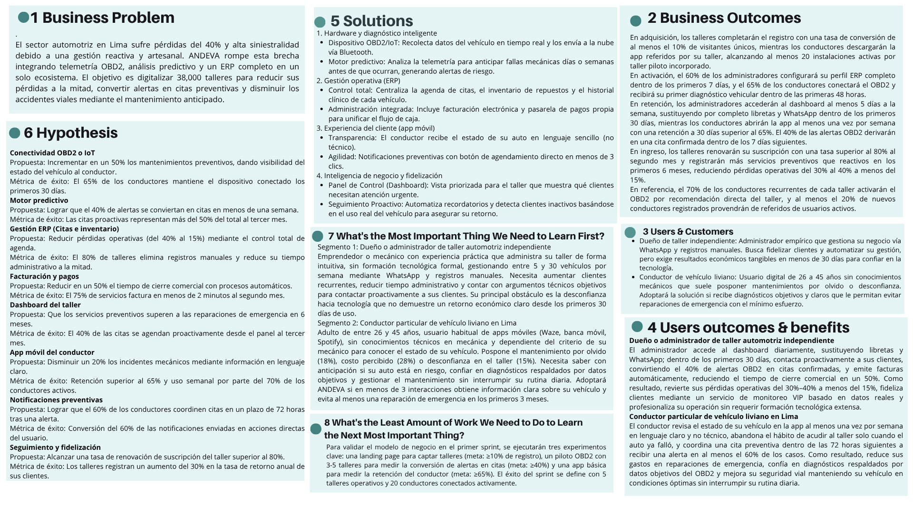

## 1.2. Solution Profile {#cap-1-2}

&emsp;&emsp;&emsp;&emsp;A continuación, se darán a conocer los detalles del perfil de la solución respaldada por antecedentes sólidos y confiables. Aparte de ello, el uso de técnicas como “Diagrama de Ishikawa”, “5W’s y 2H’s” y “Lean UX Canvas”.

### 1.2.1.&emsp;&emsp;*Antecedentes y Problemática* {#cap-1-2-1}

&emsp;&emsp;&emsp;&emsp;En Lima, el modelo de actuar ante fallos mecánicos imprevistos es reactivo. Por ello, buscamos quitar el modelo actual e instaurar un modelo proactivo que beneficie a los conductores económicamente, dándole una mayor vida útil a su vehículo, como también a los talleres, proporcionándoles una fuente de clientes fieles.

&emsp;&emsp;&emsp;&emsp;Según el informe del sector automotor, realizado por la Asociación Automotriz del Perú, señala que en los últimos dos meses del año 2026 se vendieron 41,584 unidades de vehículos livianos, representando un aumento del 36.8% respecto al año pasado en el mismo periodo (AAP, 2026, p. 5).

**Figura 2**

*Venta de vehículos livianos y pesados en el periodo enero-febrero 2026*

&emsp;&emsp;&emsp;&emsp;Con respecto a la gráfica de la Figura 3. Los resultados indican una tendencia anual a seguir comprando vehículos livianos y grandes (AAP, 2026, p. 7) que requieren de un servicio para poder mantener a estos mismos en las máximas condiciones.

**Figura 3**

*Ventas de vehículos livianos y pesados desde enero del 2020 a enero del 2026*

&emsp;&emsp;&emsp;&emsp;Hay varias formas como los seguros vehiculares, pero son muy volátiles, con servicios pésimos o no son una opción viable económicamente. Por otra parte, los 38000 talleres de Lima Metropolitana y del Callao presentaron Por otra parte, los 38000 talleres de Lima Metropolitana y del Callao presentaron pérdidas del 30% a 40%, lo que conlleva a que hay un bajo uso de estos debido a la disparidad de precios entre talleres, generando baja fidelización y flujo de clientes (Fiestas et al., 2021).

&emsp;&emsp;&emsp;&emsp;El no contar con un servicio de mantenimiento o arreglo de fallas mecánicas lleva a que según el boletín estadístico anual de siniestralidad vial 2024, realizado por el Observatorio Nacional de Seguridad Vial, señala que de un total de 87757 siniestros de tránsitos a nivel nacional el 1,2% de muertes son por partes de fallas mecánicas y de un 0,2% por falta de luces (ONSV, 2025, p. 17). Esto representaría que el 1,4% de los siniestros de tránsito son por factores vehiculares, los porcentajes pueden sonar bajos, pero en total hablamos de 1190 siniestros que pudieron haberse evitado con un mantenimiento adecuado.

**Figura 4**

*Porcentajes de siniestros según su causa, 2024*

&emsp;&emsp;&emsp;&emsp;Por ello, en andeva hemos considerado pertinente elaborar dos artefactos que pongan en perspectiva los aspectos fundamentales de la problemática que aborda “X”. Por un lado, mediante 2 diagramas de Ishikawa identificamos las causas raíz que explican el constante uso de un modelo reactivo en el Perú y baja fidelización conductor-taller.

**Figura 5**

*Diagrama de Ishikawa, efecto: Uso de un modelo reactivo en el Perú*

**Figura 6**

*Diagrama de Ishikawa, efecto: Baja fidelización conductor-taller*

&emsp;&emsp;&emsp;&emsp;Por otro lado, mediante el diagrama 5W’s + 2H’s delimitamos operativamente el problema y la solución.

**Figura 7**

*Diagrama 5W’s + 2H’s - atelier*

### 1.2.2.&emsp;&emsp;*Lean UX Process* {#cap-1-2-2}

&emsp;&emsp;&emsp;&emsp;En esta sección, se abordará el uso del Lean UX Process, una metodología específicamente diseñada y centrada en el usuario, en el cual validaremos la solución con técnicas como "Lean UX Problem Statements", "Lean UX Assumptions", "Lean UX Hypothesis Statements" y "Lean UX Canvas".

#### 1.2.2.1.&emsp;&emsp;*Lean UX Problem Statements* {#cap-1-2-2-1}

&emsp;&emsp;&emsp;&emsp;El estado actual del sector de mantenimiento automotriz en el Perú se ha centrado principalmente en un modelo de atención reactiva, donde los talleres independientes, más de 38,000 solo en Lima Metropolitana, dependen de procesos manuales e informales como libretas físicas, hojas de cálculo sin estructura y grupos de WhatsApp para gestionar su operación diaria, comunicarse con sus clientes y registrar el historial de los vehículos que atienden. Del mismo modo, los conductores particulares carecen de cualquier mecanismo que les informe de manera anticipada y comprensible sobre el estado técnico real de su vehículo, por lo que solo acuden al taller cuando la falla ya es visible o el vehículo se ha detenido por completo.

&emsp;&emsp;&emsp;&emsp;Lo que los productos y servicios existentes en el mercado peruano no logran abordar es la desconexión crítica entre el estado técnico real del vehículo, la comunicación proactiva con el conductor y la gestión administrativa del taller en un solo ecosistema integrado. Esta brecha provoca que los talleres independientes pierdan entre el 30% y el 40% de su rentabilidad potencial por ineficiencias operativas, baja fidelización y dependencia exclusiva de clientes reactivos. Por el lado del conductor, la ausencia de información anticipada genera olvido en el 18% de los casos y desconfianza en el 15%, lo que se traduce en 1,190 siniestros viales anuales causados por fallas mecánicas que pudieron haberse prevenido con un mantenimiento oportuno, según el Boletín de Siniestralidad Vial 2024 del Observatorio Nacional de Seguridad Vial. Esta problemática se agrava en un contexto donde el parque automotor de Lima crece a un ritmo del 36.8% anual, incrementando la demanda de mantenimiento sin que exista una oferta tecnológica que lo soporte de forma eficiente.

&emsp;&emsp;&emsp;&emsp;Nuestra plataforma, ANDEVA, abordará esta brecha mediante un ecosistema tecnológico que integra hardware de diagnóstico vehicular OBD2 para la recolección de telemetría en tiempo real, un motor de análisis predictivo que emite alertas automáticas antes de que una falla menor escale a avería grave, y un sistema ERP completo que centraliza y automatiza la gestión administrativa del taller: citas, inventario, historial de vehículos, empleados, facturación electrónica y pasarela de pagos. De este modo, el mantenimiento deja de ser una respuesta de emergencia y se convierte en una acción preventiva basada en datos reales, profesionalizando al taller y empoderando al conductor con información transparente y oportuna.

&emsp;&emsp;&emsp;&emsp;Nuestro enfoque inicial se centrará en dos segmentos: dueños y administradores de talleres automotrices independientes en Lima que buscan rentabilizar su operación, reducir su carga administrativa y fidelizar clientes mediante tecnología accesible; y conductores particulares de entre 26 y 45 años con perfil digital activo, propietarios de vehículos livianos en Lima Metropolitana, que representan el 70% del segmento objetivo y ya utilizan aplicaciones móviles de forma habitual en su vida diaria.

Sabremos que hemos tenido éxito cuando observemos los siguientes cambios medibles en el comportamiento de nuestra audiencia objetivo:

- **Reducción de pérdidas operativas**: Los talleres afiliados a ANDEVA disminuyen sus pérdidas operativas del 30% al 40% actual a menos del 15% en los primeros 6 meses de uso de la plataforma, como resultado de la automatización administrativa y el incremento de ingresos recurrentes por mantenimientos preventivos programados.
- **Acción preventiva sostenida**: Un aumento del 50% en las citas de mantenimiento preventivo agendadas a través de la plataforma en los primeros 6 meses, en comparación con la línea base de cada taller previo a la adopción de ANDEVA.
- **Conversión de alertas en citas**: Al menos el 40% de las notificaciones de salud vehicular generadas automáticamente por el sistema OBD2 resultan en una cita de mantenimiento confirmada y realizada en el taller dentro de los 7 días siguientes al envío de la alerta.
- **Impacto en seguridad vial**: Una disminución del 20% en los incidentes por fallas mecánicas reportados entre los conductores activos vinculados a la red de talleres de ANDEVA, medida al cabo de 6 meses de operación continua de la plataforma.

#### 1.2.2.2.&emsp;&emsp;*Lean UX Assumptions* {#cap-1-2-2-2}

**Business Assumptions**

- Los dueños de talleres independientes visitan la landing page de ANDEVA y completan el formulario de registro tras leer la propuesta de valor, con una tasa de conversión de visita a registro de al menos el 10%.
- Los conductores particulares descargan la app móvil de ANDEVA después de ser referidos por su taller de confianza, alcanzando al menos 20 instalaciones activas por cada taller piloto incorporado a la red.

**¿Empiezan a usar el producto de forma significativa?**

- Los administradores de talleres configuran completamente su perfil en la plataforma ERP (inventario inicial, datos de clientes y agenda) dentro de los primeros 7 días desde el registro, con una tasa de activación completa superior al 60%.
- Los conductores conectan el dispositivo OBD2 a su vehículo y reciben su primer diagnóstico de salud vehicular dentro de las primeras 48 horas desde la descarga de la app, con una tasa de activación del dispositivo superior al 65%.

**¿Siguen usando el producto de forma regular?**

- Los administradores de talleres acceden al panel de control de ANDEVA al menos 5 días a la semana para revisar el estado de los vehículos monitoreados, gestionar citas y procesar pagos, sustituyendo por completo el uso de libretas y WhatsApp como herramientas de gestión.
- Los conductores abren la app de ANDEVA al menos una vez por semana para revisar el estado de su vehículo, con una tasa de retención a 30 días superior al 65%.
- El 40% de las alertas de salud vehicular generadas automáticamente por el sistema OBD2 se convierte en una cita de mantenimiento confirmada y realizada dentro de los 7 días siguientes al envío de la notificación.

**¿Están pagando y generando valor económico sostenido?**

- Los talleres afiliados renuevan su suscripción mensual a ANDEVA con una tasa superior al 80% al término del segundo mes de uso, como señal de que el valor percibido supera el costo de la suscripción.
- Los talleres afiliados registran un aumento medible en el número de servicios de mantenimiento preventivo realizados por mes, superando en cantidad a los servicios reactivos de emergencia dentro de los primeros 6 meses de uso, lo que se traduce en una reducción de sus pérdidas operativas del 30% al 40% actual a menos del 15%.
- Los conductores activos evitan al menos una reparación de emergencia durante los primeros 3 meses de uso, percibiendo un ahorro económico concreto y atribuible directamente a las alertas preventivas de ANDEVA.

**¿Recomiendan el producto a otros?**

- Los talleres afiliados recomiendan activamente a sus clientes la descarga de la app del conductor, logrando que al menos el 70% de sus clientes recurrentes instalen y activen el dispositivo OBD2 dentro de los primeros 2 meses de operación del taller en la plataforma.
- Los conductores satisfechos refieren ANDEVA a otros propietarios de vehículos de su entorno, con al menos el 20% de nuevos conductores registrados provenientes de referidos directos de usuarios activos.
- El índice de satisfacción (NPS) de los conductores vinculados a talleres que usan ANDEVA supera en al menos 15 puntos al promedio del sector automotriz tradicional al cabo de 3 meses de uso activo.

**Business Outcomes Assumptions**

&emsp;&emsp;&emsp;&emsp;Creo que mis clientes necesitan dejar de gestionar su taller con libretas, hojas de cálculo y grupos de WhatsApp, y adoptar una plataforma centralizada que les permita anticiparse a las fallas de sus clientes, automatizar su facturación y controlar su inventario en tiempo real, porque la gestión manual es la causa directa de las pérdidas operativas del 30% al 40% que enfrentan actualmente.

&emsp;&emsp;&emsp;&emsp;Estas necesidades se pueden resolver con la implementación de ANDEVA, una plataforma web que integra hardware de diagnóstico vehicular OBD2 para la recolección de telemetría en tiempo real con un sistema ERP completo que centraliza citas, inventario, historial de vehículos, empleados, facturación electrónica y pasarela de pagos en un solo ecosistema accesible desde cualquier dispositivo.

&emsp;&emsp;&emsp;&emsp;Nuestros clientes iniciales son los dueños y administradores de talleres automotrices independientes en Lima Metropolitana que gestionan entre 5 y 30 vehículos por semana, buscan profesionalizar su operación y están dispuestos a adoptar tecnología si esta demuestra un retorno económico claro y medible en los primeros 3 meses de uso.

&emsp;&emsp;&emsp;&emsp;El valor principal que prioriza mi cliente (administrador del taller) es revertir sus pérdidas operativas mediante ingresos recurrentes por mantenimientos preventivos programados y reducir drásticamente el tiempo dedicado a tareas administrativas manuales. Por el lado del conductor, el mayor valor es recibir alertas anticipadas sobre el estado real de su vehículo en lenguaje claro, evitando reparaciones de emergencia costosas e imprevistas.

&emsp;&emsp;&emsp;&emsp;El cliente también puede obtener beneficios adicionales como: por el lado del taller, la capacidad de contactar proactivamente a sus clientes con alertas fundamentadas en datos reales del vehículo, lo que construye una relación de confianza y aumenta el Lifetime Value de cada conductor. Por el lado del conductor, la tranquilidad de saber que su vehículo está siendo monitoreado en tiempo real, reduciendo el riesgo de siniestros viales por fallas mecánicas prevenibles, que actualmente representan 1,190 casos anuales según la ONSV (2024).

&emsp;&emsp;&emsp;&emsp;Obtendremos clientes ofreciendo demostraciones presenciales del sistema en talleres piloto de Lima, un período de prueba gratuito de 30 días para que el administrador verifique empíricamente cómo se reducen sus tiempos administrativos y cómo el módulo OBD2 genera alertas reales sobre los vehículos de sus clientes, con métricas de uso visibles desde el primer día.

&emsp;&emsp;&emsp;&emsp;Generamos ingresos mediante un modelo de negocio SaaS con suscripción mensual escalonada según el número de vehículos monitoreados y el nivel de funcionalidades ERP habilitadas, complementado por la venta o arriendo del hardware OBD2 a los talleres afiliados que deseen ofrecer el servicio de monitoreo preventivo a sus clientes.

&emsp;&emsp;&emsp;&emsp;Nuestra competencia principal serían los sistemas de gestión de talleres genéricos que no incluyen diagnóstico predictivo, las soluciones de diagnóstico OBD2 aisladas que no integran gestión administrativa y la arraigada costumbre de operar con papel, WhatsApp y Excel, que, aunque ineficiente, resulta familiar y sin costo directo para el administrador del taller.

&emsp;&emsp;&emsp;&emsp;Los venceremos debido a que somos la única solución en el mercado peruano que integra en un solo ecosistema el diagnóstico vehicular predictivo basado en telemetría OBD2 real con un ERP completo de gestión del taller, eliminando la necesidad de usar múltiples herramientas desconectadas y transformando la relación conductor-taller de transaccional y reactiva a continua y preventiva.

&emsp;&emsp;&emsp;&emsp;Nuestros mayores riesgos son la resistencia al cambio tecnológico por parte de administradores de talleres con poca experiencia digital, la reticencia del conductor a instalar y mantener conectado el dispositivo OBD2 de forma continua y la posibilidad de que la conectividad a internet en algunos talleres de Lima sea insuficiente para garantizar la transmisión de telemetría en tiempo real.

&emsp;&emsp;&emsp;&emsp;Esto lo resolveremos implementando una experiencia de incorporación (onboarding) guiada de no más de 15 minutos para el administrador del taller, con soporte presencial en Lima durante los primeros 30 días. Para el conductor, se diseñará un flujo de instalación del OBD2 de máximo 3 pasos desde la app, con un mensaje de confirmación inmediato que demuestre que el dispositivo está funcionando correctamente.

&emsp;&emsp;&emsp;&emsp;Otras suposiciones que tenemos son que los administradores de talleres independientes en Lima cuentan con un smartphone y conexión a internet estable en su local, y que al menos el 68% de sus clientes conductores ya utiliza su celular de forma habitual mientras conduce, lo que garantiza una fricción técnica mínima para la adopción de la app. Si se comprueba que la infraestructura tecnológica de los talleres objetivo es insuficiente, se deberá evaluar un modo de operación con sincronización diferida para entornos de baja conectividad.

#### 1.2.2.3.&emsp;&emsp;*Lean UX Hypothesis Statements* {#cap-1-2-2-3}

**Hipótesis 1: Módulo OBD2 o IoT**

&emsp;&emsp;&emsp;&emsp;Creemos que lograremos un aumento del 50% en los mantenimientos preventivos agendados en la plataforma durante los primeros 6 meses, si el conductor particular de entre 26 y 45 años, propietario de un vehículo liviano en Lima, obtiene visibilidad continua y automática del estado técnico real de su vehículo sin necesidad de llevarlo al taller para obtener esa información, con el dispositivo OBD2 Bluetooth instalado en el puerto del vehículo que recolecta telemetría en tiempo real y la transmite de forma segura a la API de ANDEVA a través de la app móvil del conductor.

**Criterio de éxito**: Sabremos que tenemos razón cuando el 65% de los conductores registrados mantenga el dispositivo OBD2 conectado de forma continua durante los primeros 30 días, medido a través de los registros de actividad de transmisión de datos en la plataforma.

**Hipótesis 2: Motor predictivo y sistema de alertas automáticas**

&emsp;&emsp;&emsp;&emsp;Creemos que lograremos que al menos el 40% de las alertas de salud vehicular generadas por el sistema resulten en una cita de mantenimiento confirmada y realizada en el taller dentro de los 7 días siguientes, si el dueño o administrador del taller automotriz independiente en Lima obtiene la capacidad de anticiparse a las fallas de los vehículos de sus clientes días o semanas antes de que ocurran, con un argumento técnico objetivo que le permita contactarlos proactivamente con credibilidad, con el motor predictivo de ANDEVA que analiza la telemetría OBD2 recibida, identifica patrones de riesgo mecánico y genera alertas automáticas priorizadas en el panel del taller con el componente en riesgo y el nivel de urgencia estimado.

**Criterio de éxito**: Sabremos que tenemos razón cuando el porcentaje de citas originadas por iniciativa del taller supere el 50% del total de citas registradas en la plataforma al cierre del tercer mes de operación.

**Hipótesis 3: Módulo ERP de gestión de citas e inventario**

&emsp;&emsp;&emsp;&emsp;Creemos que lograremos una reducción de las pérdidas operativas de los talleres afiliados del 30% al 40% actual a menos del 15% en los primeros 6 meses, si el dueño o administrador del taller automotriz independiente obtiene el control total de su agenda de citas y su inventario de repuestos desde una sola plataforma, eliminando los errores, duplicidades y tiempos muertos generados por la gestión manual con libretas y hojas de cálculo, con el módulo ERP de ANDEVA que centraliza la agenda digital de citas, el control de stock de repuestos en tiempo real y el historial completo de cada vehículo atendido, accesible desde cualquier dispositivo con conexión a internet.

**Criterio de éxito**: Sabremos que tenemos razón cuando el 80% de los talleres suscritos elimine por completo el uso de registros manuales como herramienta principal de gestión dentro de los primeros 30 días, y cuando el tiempo dedicado a tareas administrativas semanales se reduzca en al menos un 50% según los registros de actividad de la plataforma.

**Hipótesis 4: Módulo de facturación electrónica y pasarela de pagos**

&emsp;&emsp;&emsp;&emsp;Creemos que lograremos una reducción del 50% en el tiempo dedicado al cierre comercial de cada servicio (facturación y cobranza) en los talleres afiliados dentro de los primeros 3 meses de uso, si el dueño o administrador del taller automotriz independiente obtiene la capacidad de emitir facturas electrónicas y procesar cobros de forma inmediata al cierre de cada servicio, sin depender de procesos manuales externos ni de herramientas desconectadas de la gestión del taller, con el módulo de facturación electrónica y pasarela de pagos integrada de ANDEVA, que genera automáticamente la factura al registrar el cierre del servicio en el sistema y permite al conductor pagar desde la app móvil o mediante un enlace de pago enviado por la plataforma.

**Criterio de éxito**: Sabremos que tenemos razón cuando el 75% de los servicios registrados en la plataforma genere su factura de forma automática sin intervención manual del administrador, y cuando el tiempo promedio entre el cierre del servicio y la emisión de la factura sea inferior a 2 minutos, medido en los registros de actividad del sistema durante el segundo mes de uso.

**Hipótesis 5: Panel de control del taller (Dashboard)**

&emsp;&emsp;&emsp;&emsp;Creemos que lograremos que el número de servicios de mantenimiento preventivo realizados mensualmente supere al número de reparaciones de emergencia reactivas en los talleres afiliados dentro de los primeros 6 meses de uso, si el dueño o administrador del taller automotriz independiente obtiene una visión centralizada, priorizada y actualizada en tiempo real del estado técnico de todos los vehículos de sus clientes monitoreados, permitiéndole identificar de un vistazo quién necesita atención urgente y actuar antes de que el conductor lo contacte por una emergencia. Con el panel de control (dashboard) de ANDEVA que agrega la telemetría OBD2 de todos los vehículos vinculados al taller, muestra una lista priorizada de clientes en riesgo con el detalle del componente afectado y habilita el agendamiento de citas proactivas directamente desde la misma interfaz sin cambiar de herramienta.

**Criterio de éxito**: Sabremos que tenemos razón cuando los administradores de talleres accedan al dashboard al menos 5 días a la semana durante el segundo mes de uso, medido en los registros de sesión de la plataforma, y cuando el porcentaje de citas proactivas iniciadas desde el panel supere el 40% del total de citas agendadas mensualmente.

**Hipótesis 6: App móvil del conductor**

&emsp;&emsp;&emsp;&emsp;Creemos que lograremos una disminución del 20% en los incidentes por fallas mecánicas entre los conductores activos vinculados a la plataforma durante los primeros 6 meses de operación, si el conductor particular de entre 26 y 45 años que actualmente pospone su mantenimiento por olvido (18%) o por desconfianza en el diagnóstico del taller (15%) obtiene acceso inmediato al estado técnico real de su vehículo en lenguaje claro y no técnico, con el historial completo de mantenimientos realizados y la posibilidad de coordinar una cita con su taller en menos de 3 interacciones desde su celular, con la app móvil de ANDEVA diseñada para conductores sin conocimientos técnicos, que muestra el estado del vehículo mediante indicadores visuales simples, presenta el historial de mantenimientos ordenado cronológicamente y permite agendar una cita con el taller vinculado directamente desde la pantalla de alerta.

**Criterio de éxito**: Sabremos que tenemos razón cuando la tasa de retención de la app a 30 días sea superior al 65%, medida en los registros de sesión de la plataforma, y cuando el 70% de los conductores activos abra la app al menos una vez por semana durante el segundo mes de uso.

**Hipótesis 7: Módulo de notificaciones preventivas**

&emsp;&emsp;&emsp;&emsp;Creemos que lograremos que el 60% de los conductores que reciban una notificación preventiva coordinen una cita de mantenimiento con su taller dentro de las 72 horas siguientes al envío de la alerta, si el conductor particular de entre 26 y 45 años que no realiza mantenimiento preventivo por olvido o por percibir el costo como elevado e incierto obtiene una notificación personalizada que le explica en lenguaje cotidiano qué componente de su vehículo está en riesgo, cuánto tiempo tiene antes de que el problema escale y cuánto le costaría atenderlo ahora versus atenderlo cuando ya sea una avería grave, con el módulo de notificaciones preventivas de ANDEVA que genera alertas push personalizadas para cada conductor basadas en la telemetría real de su vehículo, incluyendo el nombre del componente afectado en términos no técnicos, el nivel de urgencia estimado y un botón de agendamiento directo con el taller vinculado.

**Criterio de éxito**: Sabremos que tenemos razón cuando al menos el 60% de las notificaciones preventivas enviadas resulten en una acción del conductor (apertura de la app, contacto con el taller o agendamiento de cita) dentro de las 72 horas siguientes, medido en los registros de interacción de la plataforma al cierre del tercer mes de uso.

**Hipótesis 8: Módulo de seguimiento de clientes y fidelización**

&emsp;&emsp;&emsp;&emsp;Creemos que lograremos una tasa de renovación mensual de suscripción superior al 80% entre los talleres afiliados al término del segundo mes de uso, si el dueño o administrador del taller automotriz independiente obtiene un incremento medible en el porcentaje de conductores que retornan para un segundo o tercer mantenimiento dentro del mismo año, como resultado de una relación de seguimiento continuo basada en el uso real del vehículo y no en recordatorios genéricos por calendario, con el módulo de seguimiento de clientes de ANDEVA que registra automáticamente cada interacción conductor-taller, calcula la frecuencia de retorno histórica de cada cliente, identifica a los conductores inactivos con mayor riesgo de fuga y habilita el envío de recordatorios personalizados basados en la telemetría acumulada del vehículo.

**Criterio de éxito**: Sabremos que tenemos razón cuando los talleres afiliados registren un incremento del 30% en la tasa de retorno anual de sus clientes en comparación con su línea base histórica previa al uso de la plataforma, medido al cierre del sexto mes de operación, y cuando el Lifetime Value promedio por conductor aumente de forma proporcional en el mismo período.

#### 1.2.2.4.&emsp;&emsp;*Lean UX Canvas* {#cap-1-2-2-4}

**Figura 8**

*Lean UX Canvas*

