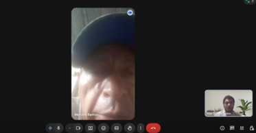
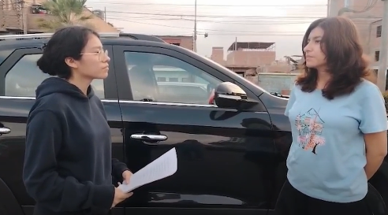

## 2.2. Entrevistas {#cap-2-2}

&emsp;&emsp;&emsp;&emsp;En esta sección, se aborda todo lo relacionado a la recopilación de información en base a las entrevistas a los segmentos objetivo identificados anteriormente.

### 2.2.1.&emsp;&emsp;*Diseño de Entrevistas* {#cap-2-2-1}

&emsp;&emsp;&emsp;&emsp;A continuación, se presenta las preguntas principales para las entrevistas de los segmentos objetivo identificados.

**Tabla 4**

*Preguntas para el Segmento Objetivo: Dueños o administradores de talleres automotrices independientes en Lima*

<table>
	<tbody>
		<tr>
			<td colspan="2">
<b>Preguntas</b>
</td>
		</tr>
		<tr>
			<td>1</td>
			<td>¿Cómo describiría un día típico administrando su taller y cuáles son sus principales objetivos comerciales a corto plazo?</td>
		</tr>
		<tr>
			<td>2</td>
			<td>¿Cuáles son los problemas mecánicos más frecuentes, graves y costosos con los que llegan los clientes a su taller?</td>
		</tr>
		<tr>
			<td>3</td>
			<td>Actualmente, ¿cómo es la comunicación con los clientes para los mantenimientos o posibles fallos que se puedan dar?</td>
		</tr>
		<tr>
			<td>4</td>
			<td>¿Qué tan difícil le resulta lograr que un cliente regrese para un mantenimiento preventivo en lugar de esperar a que el auto se malogre por completo?</td>
		</tr>
		<tr>
			<td>5</td>
			<td>¿Qué herramientas digitales, software o aplicaciones utiliza en este momento para gestionar las citas, el historial de clientes o el diagnóstico de los vehículos?</td>
		</tr>
		<tr>
			<td>6</td>
			<td>¿Hay alguna marca de escáner automotriz, software o herramienta tecnológica en la que confíe plenamente y considere indispensable en su taller?</td>
		</tr>
		<tr>
			<td>7</td>
			<td>¿Con qué frecuencia utiliza herramientas de diagnóstico por puerto OBD2 y qué tan familiarizado está su equipo con la lectura de estos datos?</td>
		</tr>
		<tr>
			<td>8</td>
			<td>Si su taller tuviera la capacidad de saber anticipadamente que el auto de un cliente está a punto de presentar una falla grave, ¿cómo aprovecharía esa ventaja?</td>
		</tr>
		<tr>
			<td>9</td>
			<td>¿Qué le parecería contar con una plataforma web que le alerte automáticamente sobre posibles fallas en los autos de sus clientes para que usted pueda contactarlos proactivamente y agendar una cita?</td>
		</tr>
		<tr>
			<td>10</td>
			<td>¿Qué impacto cree que tendría ofrecer este servicio de "monitoreo preventivo" en la confianza y la fidelidad de sus clientes actuales?</td>
		</tr>
		<tr>
			<td>11</td>
			<td>¿Estaría dispuesto a recomendar a sus clientes el uso de un pequeño dispositivo OBD2 con Bluetooth para poder monitorear sus vehículos a distancia?</td>
		</tr>
		<tr>
			<td>12</td>
			<td>Para gestionar citas, ¿prefiere utilizar una computadora de escritorio en su oficina, una laptop, su teléfono cellular o a mano?</td>
		</tr>
		<tr>
			<td>13</td>
			<td>¿Cómo describiría su personalidad al momento de adoptar nuevas tecnologías en su negocio: precavido, curioso o pionero?</td>
		</tr>
		<tr>
			<td>14</td>
			<td>¿Qué redes sociales o plataformas utiliza más para informarse sobre novedades en mecánica y gestión de talleres?</td>
		</tr>
		<tr>
			<td>15</td>
			<td>¿Qué funciones específicas le gustaría ver en un "panel de control" diseñado exclusivamente para su taller?</td>
		</tr>
	</tbody>
</table>

**Tabla 5**

*Preguntas para el Segmento Objetivo: Conductores de vehículos de Lima*

<table>
	<tbody>
		<tr>
			<td colspan="2">
<b>Preguntas</b>
</td>
		</tr>
		<tr>
			<td>1</td>
			<td>¿Para qué utiliza su vehículo principalmente en su día a día y qué metas tiene respecto al cuidado de su auto?</td>
		</tr>
		<tr>
			<td>2</td>
			<td>Cuénteme sobre la peor experiencia o la mayor frustración que haya tenido relacionada con una avería mecánica inesperada.</td>
		</tr>
		<tr>
			<td>3</td>
			<td>¿Cómo lleva actualmente el control de los mantenimientos de su auto (cambios de aceite, revisión de frenos, etc.)? ¿Usa alguna libreta, app o se fía de su memoria?</td>
		</tr>
		<tr>
			<td>4</td>
			<td>¿Cómo es su relación con su mecánico o taller de confianza y por qué medio de comunicación prefieren coordinar (WhatsApp, llamadas, redes)?</td>
		</tr>
		<tr>
			<td>5</td>
			<td>¿Se considera una persona hábil con la tecnología? ¿Cuáles son las tres aplicaciones móviles que más utiliza en su día a día?</td>
		</tr>
		<tr>
			<td>6</td>
			<td>¿Qué marcas de tecnología le generan más confianza y le facilitan la vida diaria?</td>
		</tr>
		<tr>
			<td>7</td>
			<td>¿Alguna vez se ha encendido la luz de "Check Engine" en su tablero? ¿Qué suele hacer inmediatamente cuando eso ocurre?</td>
		</tr>
		<tr>
			<td>8</td>
			<td>¿Qué pensaría si su mecánico le escribiera un mensaje de WhatsApp advirtiéndole de una posible falla en su motor semanas antes de que usted lo note o de que el auto se detenga?</td>
		</tr>
		<tr>
			<td>9</td>
			<td>¿Estaría dispuesto a mantener conectado un pequeño escáner Bluetooth/WiFi en su auto y descargar una app en su celular si eso le ayuda a prevenir fallas mecánicas costosas?</td>
		</tr>
		<tr>
			<td>10</td>
			<td>¿Le generaría alguna preocupación compartir los datos internos de funcionamiento de su vehículo con su taller mecánico para poder recibir este servicio predictivo?</td>
		</tr>
		<tr>
			<td>11</td>
			<td>¿Suele mantener el Bluetooth o datos móviles de su celular encendido de forma habitual mientras conduce?</td>
		</tr>
		<tr>
			<td>12</td>
			<td>¿Qué tan frustrante le resulta tener que descargar crearse cuentas en nuevas aplicaciones móviles?</td>
		</tr>
		<tr>
			<td>13</td>
			<td>¿Qué beneficio exacto le convencería de descargar la aplicación de su taller mecánico?</td>
		</tr>
		<tr>
			<td>14</td>
			<td>Al momento de cuidar su auto, ¿cómo se describiría: una persona "reactiva" o "preventiva" a los fallos vehiculares?</td>
		</tr>
		<tr>
			<td>15</td>
			<td>Si su auto presentara un problema no urgente, ¿prefiere que el taller le avise mediante una llamada telefónica formal, un correo electrónico o un mensaje rápido de WhatsApp?</td>
		</tr>
	</tbody>
</table>

### 2.2.2.&emsp;&emsp;Registro de Entrevistas* {#cap-2-2-2}

&emsp;&emsp;&emsp;&emsp;A continuación, se mostrarán los registros de las entrevistas realizadas a nuestros segmentos objetivos. Cada entrevista conforma un cuadro, el cual contiene lo siguiente nombre, edad, provincia y ocupación, captura de pantalla de la entrevista, link de la entrevista: [upc-pre-202610-1asi0730-12158-andeva-needfinding-sprint-1](https://upcedupe-my.sharepoint.com/:v:/g/personal/u20241e275_upc_edu_pe/IQAHYbVzYrCwSoSTg872M1BoAXHdPN8K8MJI2v-W5eMz-b8?nav=eyJyZWZlcnJhbEluZm8iOnsicmVmZXJyYWxBcHAiOiJPbmVEcml2ZUZvckJ1c2luZXNzIiwicmVmZXJyYWxBcHBQbGF0Zm9ybSI6IldlYiIsInJlZmVycmFsTW9kZSI6InZpZXciLCJyZWZlcnJhbFZpZXciOiJNeUZpbGVzTGlua0NvcHkifX0&e=LzmhQp) y resumen de la entrevista.

**Segmento Objetivo 1: Dueños o administradores de talleres automotrices independientes en Lima**

**Tabla 6**

*Entrevista a Marcelo Ramos*

<table>
	<tbody>
		<tr>
			<td>
<b>Datos del Entrevistado</b>
</td>
			<td rowspan="2"></td>
		</tr>
		<tr>
			<td>Nombre: Marcelo Ramos 
            Edad: 73 
            Provincia: Lima 
            Ocupación: Mecánico 
			Minuto de inicio: 00:00 
			Duración: 17:24min 
            </td>
		</tr>
		<tr>
			<td colspan="2">
<b>Resumen</b>
</td>
		</tr>
		<tr>
			<td colspan="2">Es mecánico desde 1976, especializado en maquinaria pesada, motores diésel y gasolineros. Actualmente se apoya en su vasta experiencia para gestionar la empresa y apoya constantemente a estudiantes de SENATI. Atiende fallas simples que terminan en problemas graves, principalmente recalentamientos ocasionados por el descuido de los conductores. Solicita que las plataformas o aplicaciones web sean claras y transparentes. Siente frustración con los sistemas actuales porque a menudo no son sinceros con la información que solicitan o bloquean el ingreso de datos a la mitad del proceso.</td>
		</tr>
	</tbody>
</table>

**Tabla 7**

*Entrevista a Jorge Aguilar*

<table>
	<tbody>
		<tr>
			<td>
<b>Datos del Entrevistado</b>
</td>
			<td rowspan="2"></td>
		</tr>
		<tr>
			<td>Nombre: Jorge Aguilar 
            Edad: 65 
            Provincia: Lima 
            Ocupación: Mecánico 
			Minuto de inicio: 17:24 
			Duración: 18:34min 
            </td>
		</tr>
		<tr>
			<td colspan="2">
<b>Resumen</b>
</td>
		</tr>
		<tr>
			<td colspan="2">Es técnico mecánico automotriz con aproximadamente 53 años de experiencia. Su flujo de trabajo consiste en recibir al cliente, evaluar directamente el vehículo con su personal y dialogar con el dueño sobre los tiempos de solución y disponibilidad de repuestos. No se considera muy apegado a la tecnología de manera independiente, pero utiliza enlaces que le envían sus proveedores y revisa YouTube para actualizarse sobre nuevos motores o piezas modernas. Prefiere buscar orientación cuando le llega un equipo nuevo para no entorpecer su trabajo. Le resultaría muy útil contar con una plataforma que envíe una alerta para las fallas vehiculares, aprovechando que los equipos actuales están llenos de sensores.</td>
		</tr>
	</tbody>
</table>

**Tabla 8**

*Entrevista a Reinaldo Machacca*

<table>
	<tbody>
		<tr>
			<td>
<b>Datos del Entrevistado</b>
</td>
			<td rowspan="2"></td>
		</tr>
		<tr>
			<td>Nombre: Reinaldo Machacca 
            Edad: 41 
            Provincia: Lima 
            Ocupación: Mecánico Electrónico 
			Minuto de inicio: 54:32 
			Duración: 18:38min 
            </td>
		</tr>
		<tr>
			<td colspan="2">
<b>Resumen</b>
</td>
		</tr>
		<tr>
			<td colspan="2">Es un técnico que maneja una cartera de clientes y se especializa en las fallas electrónicas y de electricidad de los vehículos (cilindros, sensores ABS, TPMS y unidades de control). Valora mucho tener las herramientas actualizadas para no quedarse atrás con los autos modernos (2025-2026) y se mantiene en constante comunicación con sus proveedores de equipos de diagnóstico para recibir avisos de actualizaciones. Reconoce que instalar un dispositivo de diagnóstico directamente en el vehículo sería de gran ayuda. Desea un aplicativo que sirva como panel de control para llevar el historial exacto de cada vehículo: fecha de mantenimiento, kilometraje, fallas reparadas y trabajos realizados.</td>
		</tr>
	</tbody>
</table>

**Segmento Objetivo 2: Conductores de vehículos de Lima**

**Tabla 9**

*Entrevista a Henry Huamani*

<table>
	<tbody>
		<tr>
			<td>
<b>Datos del Entrevistado</b>
</td>
			<td rowspan="2"></td>
		</tr>
		<tr>
			<td>Nombre: Henry Huamani 
            Edad: 53 
            Provincia: Lima 
            Ocupación: Conductor 
			Minuto de inicio: 54:36 
			Duración: 11:50min 
            </td>
		</tr>
		<tr>
			<td colspan="2">
<b>Resumen</b>
</td>
		</tr>
		<tr>
			<td colspan="2">Utiliza el vehículo exclusivamente para transportarse a su trabajo y uso personal. Se considera un conductor preventivo que realiza mantenimientos guiándose por el tacómetro. Vivió una pésima experiencia cuando su auto recalentó por una falla en el termostato camino al trabajo, afectando gravemente el radiador y el motor, lo que resultó en un perjuicio económico y un retraso laboral. Ya utiliza el Bluetooth de forma habitual para la radio del auto y le resulta fácil descargar aplicaciones. Adoptaría la aplicación de su taller principalmente para optimizar su tiempo al sacar citas. Prefiere ser notificado sobre problemas no urgentes mediante un mensaje de WhatsApp.</td>
		</tr>
	</tbody>
</table>

**Tabla 10**

*Entrevista a Daniela Rodriguez*

<table>
	<tbody>
		<tr>
			<td>
<b>Datos del Entrevistado</b>
</td>
			<td rowspan="2"></td>
		</tr>
		<tr>
			<td>Nombre: Daniela Rodriguez 
            Edad: 31 
            Provincia: Lima 
            Ocupación: Administración 
			Minuto de inicio: 01:06:27 
			Duración: 10:28min 
            </td>
		</tr>
		<tr>
			<td colspan="2">
<b>Resumen</b>
</td>
		</tr>
		<tr>
			<td colspan="2">Utiliza el vehículo exclusivamente para transportarse a su trabajo y uso personal. Se considera un conductor preventivo que realiza mantenimientos guiándose por el tacómetro. Vivió una pésima experiencia cuando su auto recalentó por una falla en el termostato camino al trabajo, afectando gravemente el radiador y el motor, lo que resultó en un perjuicio económico y un retraso laboral. Ya utiliza el Bluetooth de forma habitual para la radio del auto y le resulta fácil descargar aplicaciones. Adoptaría la aplicación de su taller principalmente para optimizar su tiempo al sacar citas. Prefiere ser notificado sobre problemas no urgentes mediante un mensaje de WhatsApp.</td>
		</tr>
	</tbody>
</table>

**Tabla 11**

*Entrevista a Roxana Conde*

<table>
	<tbody>
		<tr>
			<td>
<b>Datos del Entrevistado</b>
</td>
			<td rowspan="2"></td>
		</tr>
		<tr>
			<td>Nombre: Roxana Conde 
            Edad: 22 
            Provincia: Lima 
            Ocupación: Estudiante Universitaria 
			Minuto de inicio: 01:16:56 
			Duración: 10:51min 
            </td>
		</tr>
		<tr>
			<td colspan="2">
<b>Resumen</b>
</td>
		</tr>
		<tr>
			<td colspan="2">Es universitaria y utiliza su vehículo (el primero que tiene) para ir a estudiar, hacer prácticas y salir con amigos. Admite ser desordenada con el control de sus mantenimientos y, aunque actualmente es reactiva ante los fallos, le gustaría volverse preventiva para evitar accidentes, gastos excesivos y alargar la vida del auto. Su auto no encendió repentinamente la mañana de un examen muy importante, lo que causó muchísimo estrés y provocó que perdiera la prueba por exceso de confianza en el auto. Desearía recibir recordatorios automáticos sobre las fallas que podría presentar su automóvil y cotizaciones aproximadas de cuánto le costará. Prefiere que las notificaciones no urgentes le lleguen por WhatsApp por ser la plataforma que más revisa, dejando las llamadas telefónicas solo para averías críticas.</td>
		</tr>
	</tbody>
</table>

### 2.2.3.&emsp;&emsp;*Análisis de Entrevistas* {#cap-2-2-3}

&emsp;&emsp;&emsp;&emsp;Recopilando la información obtenida de las entrevistas, se obtuvieron los siguientes análisis por cada segmento objetivo.

**Segmento Objetivo 1: Dueños o administradores de talleres automotrices independientes en Lima**

&emsp;&emsp;&emsp;&emsp;El 100% del personal entrevistado tiene participación directa en las reparaciones mecánicas del taller. El 75% corresponde a técnicos mecánicos senior con décadas de experiencia o alta especialización (diagnósticos electrónicos), mientras que el 25% representa a la nueva generación. El 75% de los entrevistados emplea internet, YouTube o enlaces enviados por sus proveedores para mantenerse al día con los avances del mercado.

&emsp;&emsp;&emsp;&emsp;El 50% manifiesta que gran parte de su trabajo correctivo pesado (como recalentamientos de motor) es consecuencia directa de la negligencia y falta de prevención de los conductores. Además, el 50% expresa rechazo hacia las plataformas web que son opacas, bloquean procesos a la mitad o entorpecen su flujo de trabajo.

&emsp;&emsp;&emsp;&emsp;El 100% se muestra abierto a integrar tecnología que optimice su operación. Específicamente, el 50% desea un panel de control que centralice el historial clínico del vehículo (mantenimientos previos, kilometraje y reparaciones). Un 25% menciona explícitamente el valor de aprovechar los sensores del auto para recibir alertas automáticas en el taller.

**Segmento Objetivo 2: Conductores de vehículos de Lima**

&emsp;&emsp;&emsp;&emsp;El 100% de la muestra emplea el vehículo como medio de transporte primario para actividades laborales, académicas y recreativas. El 80% de los usuarios entrevistados mantiene el Bluetooth de su dispositivo móvil encendido durante sus trayectos, lo que valida la viabilidad técnica de la transmisión de datos IoT en la cabina.

&emsp;&emsp;&emsp;&emsp;El 60% afirma tener intención de llevar un cuidado preventivo, apoyándose en el tacómetro o libretas manuales. El 40% restante reconoce ser totalmente reactivo o desordenado, pero manifiesta voluntad de cambio hacia la prevención. El 100% de los encuestados reporta como su peor experiencia una inmovilización inesperada. Esto demuestra que el dolor principal no es solo económico, sino la pérdida de tiempo y el impacto en su vida personal/laboral.

&emsp;&emsp;&emsp;&emsp;El 80% establece WhatsApp como el canal ideal y menos invasivo para recibir recordatorios y agendar citas. Solo un 20% prefiere el contacto tradicional mediante llamada telefónica para mantener una relación personal con el mecánico. El 80% usaría una aplicación si esta les notifica preventivamente las fallas, les genera alertas por fechas de mantenimiento y proporciona cotizaciones transparentes previas al servicio.