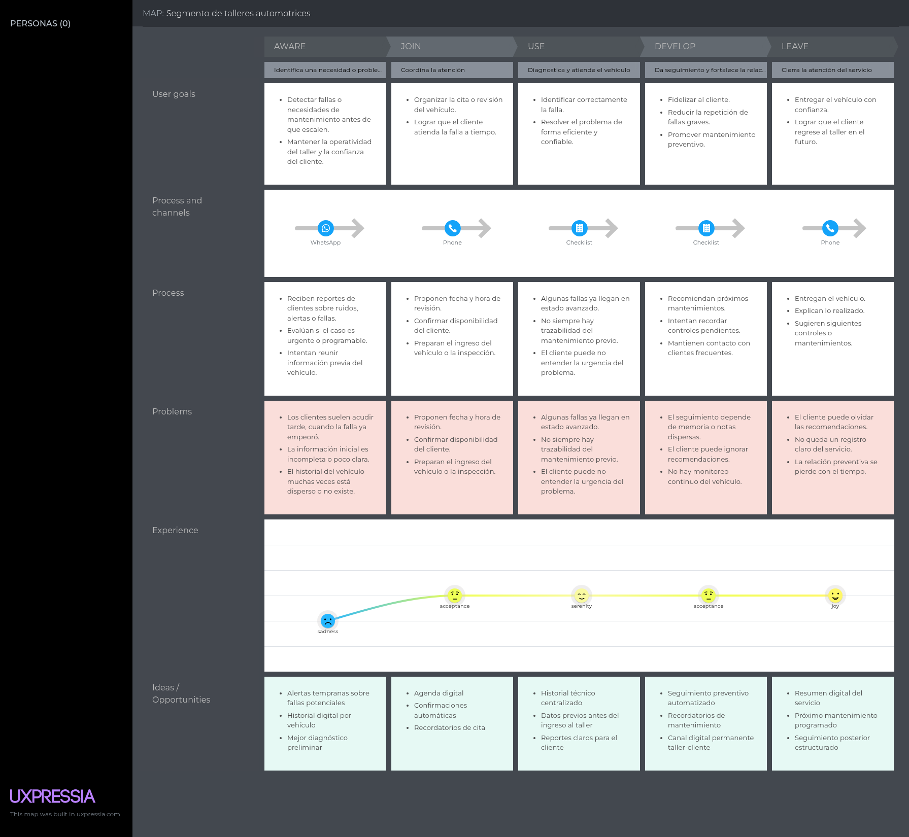

## 2.3.3. User Journey Mapping {#cap-2-3-3}

&emsp;&emsp;&emsp;&emsp;En esta sección, se presentan los User Journey Maps elaborados para los segmentos objetivo identificados.

### 2.3.3.1. User Journey Map del segmento de talleres automotrices

<strong></strong> User Journey Map As-Is del segmento de talleres automotrices.

### 2.3.3.2. User Journey Map del segmento de conductores de vehículos particulares

<strong></strong> User Journey Map As-Is del segmento de conductores de vehículos particulares.

