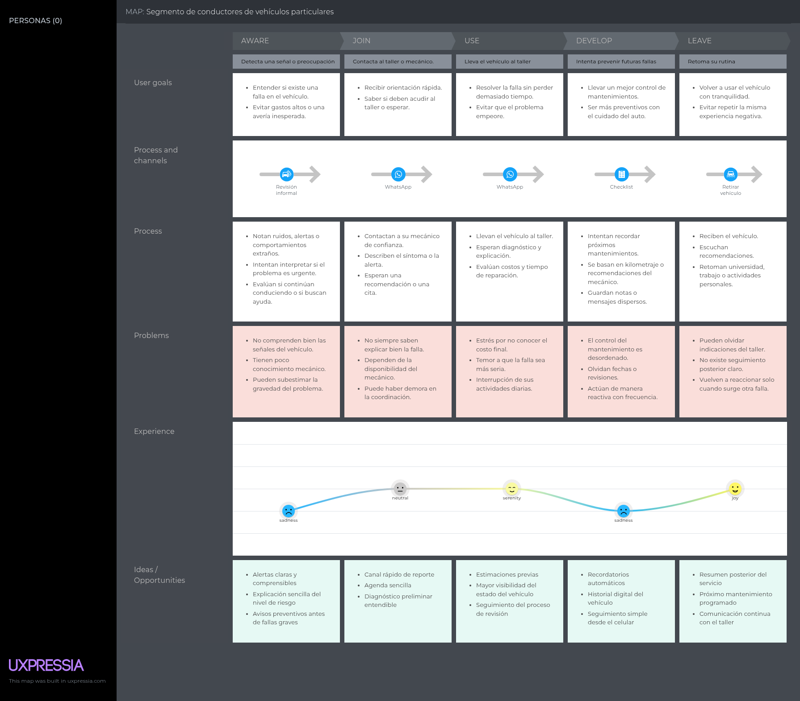
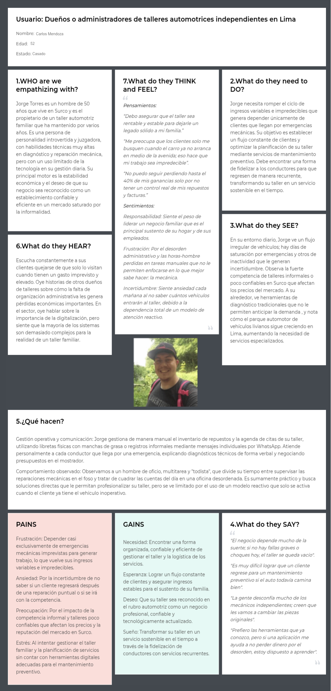
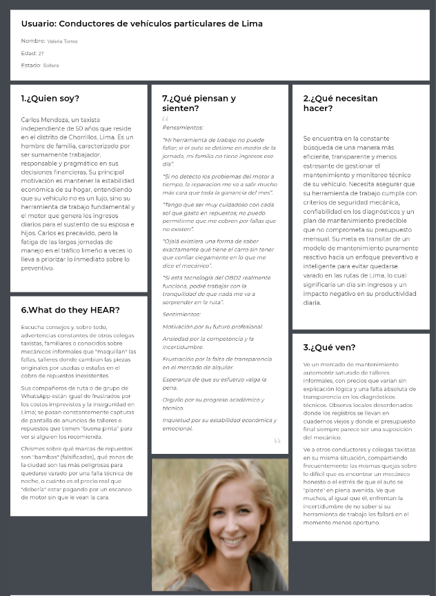
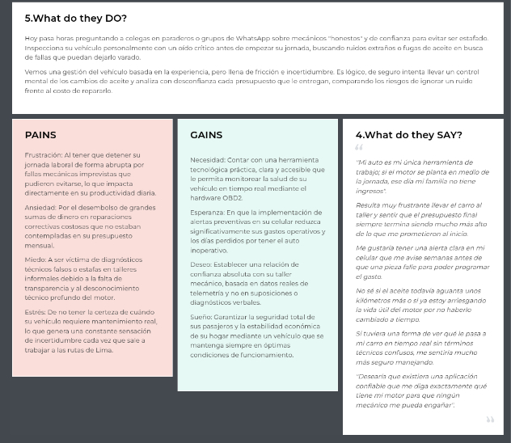

## 2.3. Needfinding {#cap-2-3}

&emsp;&emsp;&emsp;&emsp;En esta sección se explica y presenta los artefactos resultantes del proceso de análisis de la información recolectada.

### 2.3.1.&emsp;&emsp;*User Personas*{#cap-2-3-1}

&emsp;&emsp;&emsp;&emsp;En esta sección, se presentan los User Personas elaborados a partir del análisis de entrevistas realizadas a los segmentos objetivo. Estos arquetipos permiten representar las necesidades, motivaciones, frustraciones y comportamientos principales de los usuarios considerados para la solución atelier. Asimismo, permiten comprender de manera más clara cómo cada segmento interactúa actualmente con el mantenimiento vehicular, la gestión de fallas y la comunicación entre conductores y talleres automotrices.

&emsp;&emsp;&emsp;&emsp;Para la elaboración de estos arquetipos, se consideraron dos segmentos principales: los talleres automotrices, representados por un dueño y mecánico principal de taller; y los conductores de vehículos particulares, representados por una usuaria que busca mayor control, prevención y confianza en el cuidado de su vehículo.

**Segmento Objetivo 1: Dueños o administradores de talleres automotrices independientes en Lima**

**Figura 10** 

*User persona de dueños o administradores de talleres*

**Segmento Objetivo 2: Conductores de vehículos de Lima**

**Figura 11**

*User persona de conductores de vehículos*

### 2.3.2.&emsp;&emsp;*User Task Matrix* {#cap-2-3-2}

&emsp;&emsp;&emsp;&emsp;La User Task Matrix servirá para el análisis que permite consolidar y priorizar las actividades esenciales de las User personas para alcanzar sus objetivos de negocio o personales. A cada actividad se le asigna un nivel en cuanto a qué tanta importancia posee y qué tan frecuente es la actividad realizada por el User Persona.

<table border="1" style="border-collapse: collapse; width: 100%; border-color: black;">
	<tbody>
		<tr>
            <td rowspan="2"><b>Tareas (Task)</b></td>
			<td colspan="2">
<b>Carlos Mendoza</b>
</td>
			<td colspan="2">
<b>Valeria Torres</b>
</td>
        </tr>
        <tr>
			<td>Importancia</td>
			<td>Frecuencia</td>
            <td>Importancia</td>
			<td>Frecuencia</td>
        </tr>
        <tr>
            <td>
Monitoreo del estado del vehículo
</td>
            <td>Media</td>
            <td>Media</td>
            <td>Alta</td>
            <td>Media</td>
        </tr>
        <tr>
            <td>
Búsqueda o selección de taller de confianza
</td>
            <td>N/A</td>
            <td>N/A</td>
            <td>Alta</td>
            <td>Media</td>
        </tr>
        <tr>
            <td>
Atención de fallas mecánicas de emergencia
</td>
            <td>Alta</td>
            <td>Alta</td>
            <td>Alta</td>
            <td>Baja</td>
        </tr>
        <tr>
            <td>
Cálculo de presupuesto para reparaciones
</td>
            <td>Alta</td>
            <td>Alta</td>
            <td>Alta</td>
            <td>Media</td>
        </tr>
        <tr>
            <td>
Registro de historial de servicios realizados
</td>
            <td>Media</td>
            <td>Media</td>
            <td>Media</td>
            <td>Baja</td>
        </tr>
        <tr>
            <td>
Planificación de ingresos
</td>
            <td>Alta</td>
            <td>Alta</td>
            <td>Alta</td>
            <td>Alta</td>
        </tr>
        <tr>
            <td>
Abastecimiento de repuestos e insumos
</td>
            <td>Alta</td>
            <td>Alta</td>
            <td>N/A</td>
            <td>N/A</td>
        </tr>
        <tr>
            <td>
Fidelización y comunicación con clientes
</td>
            <td>Alta</td>
            <td>Media</td>
            <td>N/A</td>
            <td>Baja</td>
        </tr>
    </tbody>
</table>

### 2.3.3.&emsp;&emsp;*User Journey Mapping* {#cap-2-3-3}
&emsp;&emsp;&emsp;&emsp;El User Journey Mapping es una técnica que permite visualizar el proceso que sigue el usuario para cumplir un objetivo, ayudándonos a entender sus acciones, emociones y puntos de dolor.

**Segmento Objetivo 1: Dueños o administradores de talleres automotrices independientes en Lima**

**Figura 12** 

*User journey mapping de dueños o administradores de talleres*

**Segmento Objetivo 2: Conductores de vehículos de Lima**

**Figura 13**

*User journey mapping de conductores de vehículos*

### 2.3.4.&emsp;&emsp;*Empathy Mapping* {#cap-2-3-4}

&emsp;&emsp;&emsp;&emsp;El Empathy Mapping ayuda a entender de manera más profunda a nuestros User Personas. Con esta herramienta, capturamos lo que cada usuario siente, dice, piensa y hace desde su propia perspectiva. Además, nos permite identificar sus dolores y metas, información que resulta clave para formar ideas de diseño útiles.

**Segmento Objetivo 1: Dueños o administradores de talleres automotrices independientes en Lima**

**Figura 14** 

*Empathy Mapping de dueños o administradores de talleres automotrices independientes en Lima*

**Segmento Objetivo 2: Conductores de vehículos de Lima**

**Figura 15**

*Empathy Mapping de conductores de vehículos de Lima*

