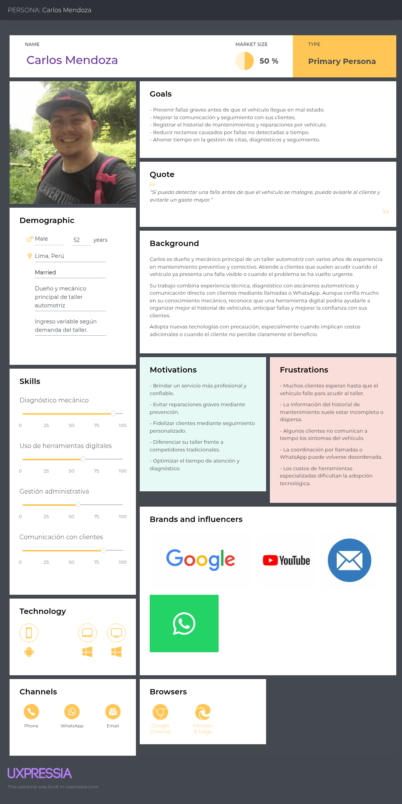

## 2.3.1. User Personas {#cap-2-3-1}

&emsp;&emsp;&emsp;&emsp;En esta sección, se presentan los User Personas elaborados a partir del análisis de entrevistas realizadas a los segmentos objetivo. Estos arquetipos permiten representar las necesidades, motivaciones, frustraciones y comportamientos principales de los usuarios considerados para la solución atelier. Asimismo, permiten comprender de manera más clara cómo cada segmento interactúa actualmente con el mantenimiento vehicular, la gestión de fallas y la comunicación entre conductores y talleres automotrices.

&emsp;&emsp;&emsp;&emsp;Para la elaboración de estos arquetipos, se consideraron dos segmentos principales: los talleres automotrices, representados por un dueño y mecánico principal de taller; y los conductores de vehículos particulares, representados por una usuaria que busca mayor control, prevención y confianza en el cuidado de su vehículo.

<strong>Figura X:</strong> User Persona de Carlos Mendoza, dueño de taller automotriz.

<strong>Figura X:</strong> User Persona de Valeria Torres, conductora de vehículo particular.

