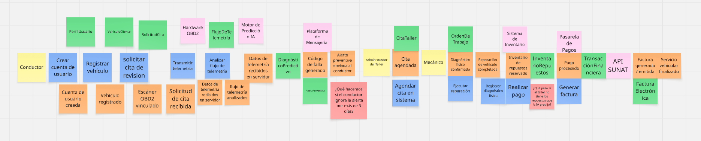

## 2.4. Big Picture Event Storming {#cap-2-4}

&emsp;&emsp;&emsp;&emsp;En esta sección se presenta el resultado del Big Picture Event Storming, una técnica colaborativa utilizada para mapear los eventos clave del dominio de atelier. Este proceso permitió visualizar el flujo completo del sistema, desde la captación de telemetría hasta la gestión administrativa, facilitando la identificación de procesos críticos y oportunidades de optimización en el modelo de negocio.

**Figura**

*Tablero de Big Picture Event Storming de atelier*

