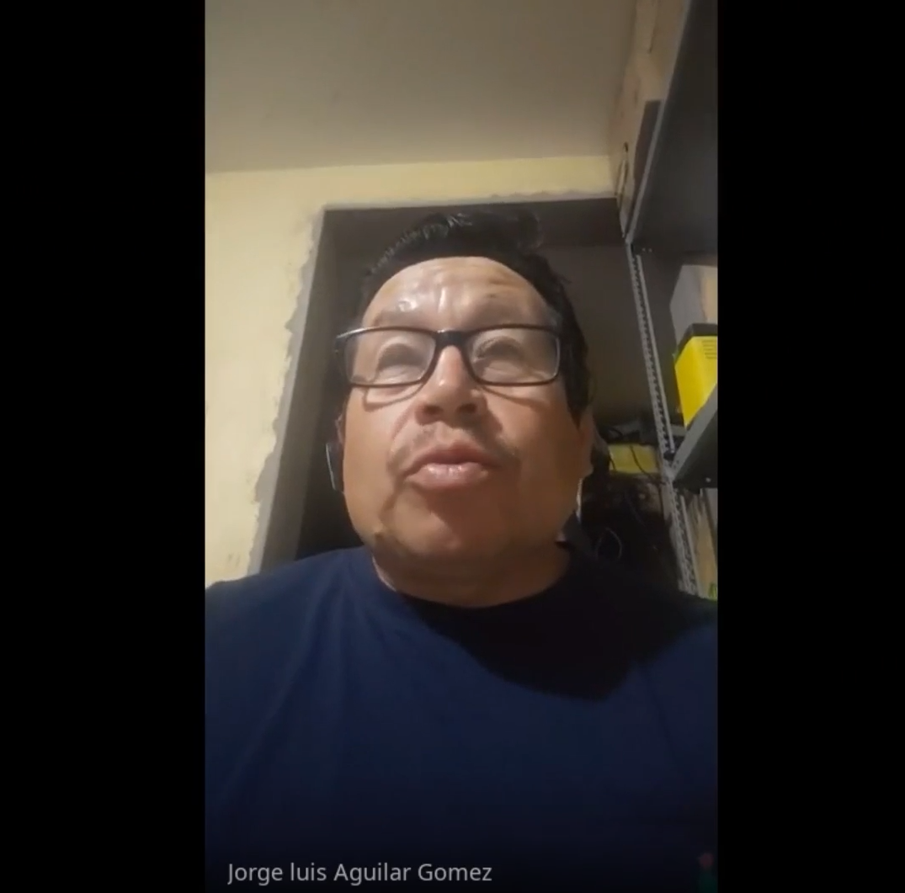
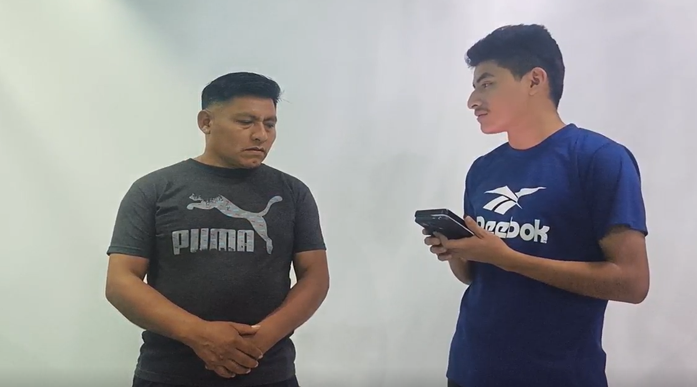
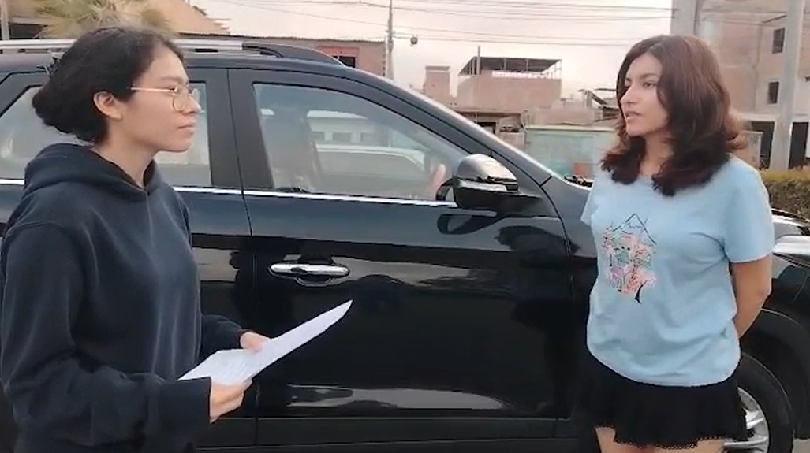

## 2.1.2. Registro de entrevistas {#cap-2-1-2}

&emsp;&emsp;&emsp;&emsp;En esta sección, se presentan los registros de entrevistas realizadas durante el proceso de needfinding. Estas entrevistas permitieron recopilar información directa de los segmentos objetivo, conformados por propietarios o trabajadores de talleres automotrices y conductores de vehículos particulares.

### Entrevista #1

<table style="width:100%; border-collapse:collapse; border:1px solid #000;">
  <tr style="background-color:#b4c7e7;">
    <th colspan="4" style="border:1px solid #000; padding:8px; text-align:center;">Entrevista #1</th>
  </tr>
  <tr>
    <td style="border:1px solid #000; padding:8px;"><strong>Nombre completo</strong></td>
    <td style="border:1px solid #000; padding:8px;">Marcelo Ramos</td>
    <td style="border:1px solid #000; padding:8px;"><strong>Distrito</strong></td>
    <td style="border:1px solid #000; padding:8px;">Chorrillos</td>
  </tr>
  <tr>
    <td style="border:1px solid #000; padding:8px;"><strong>Edad</strong></td>
    <td style="border:1px solid #000; padding:8px;">50</td>
    <td style="border:1px solid #000; padding:8px;"><strong>Ocupación</strong></td>
    <td style="border:1px solid #000; padding:8px;">Mecánico de maquinaria pesada</td>
  </tr>
  <tr>
    <td style="border:1px solid #000; padding:8px;"><strong>Inicio y duración</strong></td>
    <td colspan="3" style="border:1px solid #000; padding:8px;">00:00 - 17:23</td>
  </tr>
  <tr>
    <td style="border:1px solid #000; padding:8px;"><strong>Enlace</strong></td>
    <td colspan="3" style="border:1px solid #000; padding:8px;">
      <a href="https://upcedupe-my.sharepoint.com/:v:/g/personal/u20241e275_upc_edu_pe/IQAfMeWBkxLHS6SoqYagJMz8AWPysqFGVBmQyaVEVFY9QmI?nav=eyJyZWZlcnJhbEluZm8iOnsicmVmZXJyYWxBcHAiOiJPbmVEcml2ZUZvckJ1c2luZXNzIiwicmVmZXJyYWxBcHBQbGF0Zm9ybSI6IldlYiIsInJlZmVycmFsTW9kZSI6InZpZXciLCJyZWZlcnJhbFZpZXciOiJNeUZpbGVzTGlua0NvcHkifX0&e=dlktwP">upc-pre-202610-1asi0730-12158-andeva-needfinding-sprint-1</a>
    </td>
  </tr>
  <tr style="background-color:#b4c7e7;">
    <th colspan="2" style="border:1px solid #000; padding:8px;">Resumen</th>
    <th colspan="2" style="border:1px solid #000; padding:8px;">Foto</th>
  </tr>
  <tr>
    <td colspan="2" style="border:1px solid #000; padding:8px; vertical-align:top;">
      El entrevistado indicó que muchas fallas graves se originan por descuido del mantenimiento, como fugas de agua, fugas de aceite, recalentamiento y problemas internos del motor. Además, mencionó que la comunicación con sus clientes se realiza principalmente mediante llamadas y coordinación directa. Considera que una plataforma que alerte posibles fallas sería útil para prevenir daños costosos y mejorar la relación de confianza entre el taller y el cliente.
    </td>
    <td colspan="2" style="border:1px solid #000; padding:8px; text-align:center;">
      
    </td>
  </tr>
</table>

### Entrevista #2

<table style="width:100%; border-collapse:collapse; border:1px solid #000;">
  <tr style="background-color:#b4c7e7;">
    <th colspan="4" style="border:1px solid #000; padding:8px; text-align:center;">Entrevista #2</th>
  </tr>
  <tr>
    <td style="border:1px solid #000; padding:8px;"><strong>Nombre completo</strong></td>
    <td style="border:1px solid #000; padding:8px;">Jorge Aguilar</td>
    <td style="border:1px solid #000; padding:8px;"><strong>Distrito</strong></td>
    <td style="border:1px solid #000; padding:8px;">Arequipa</td>
  </tr>
  <tr>
    <td style="border:1px solid #000; padding:8px;"><strong>Edad</strong></td>
    <td style="border:1px solid #000; padding:8px;">53</td>
    <td style="border:1px solid #000; padding:8px;"><strong>Ocupación</strong></td>
    <td style="border:1px solid #000; padding:8px;">Técnico mecánico automotriz</td>
  </tr>
  <tr>
    <td style="border:1px solid #000; padding:8px;"><strong>Inicio y duración</strong></td>
    <td colspan="3" style="border:1px solid #000; padding:8px;">00:01 - 18:19</td>
  </tr>
  <tr>
    <td style="border:1px solid #000; padding:8px;"><strong>Enlace</strong></td>
    <td colspan="3" style="border:1px solid #000; padding:8px;">
      <a href="https://upcedupe-my.sharepoint.com/:v:/g/personal/u20241e275_upc_edu_pe/IQAyiKA4UNTwRJugdZcr_ykYAeBt3ZvuNCK-Utf22zVwmkA?nav=eyJyZWZlcnJhbEluZm8iOnsicmVmZXJyYWxBcHAiOiJPbmVEcml2ZUZvckJ1c2luZXNzIiwicmVmZXJyYWxBcHBQbGF0Zm9ybSI6IldlYiIsInJlZmVycmFsTW9kZSI6InZpZXciLCJyZWZlcnJhbFZpZXciOiJNeUZpbGVzTGlua0NvcHkifX0&e=hga4mI">upc-pre-202610-1asi0730-12158-andeva-needfinding-sprint-2</a>
    </td>
  </tr>
  <tr style="background-color:#b4c7e7;">
    <th colspan="2" style="border:1px solid #000; padding:8px;">Resumen</th>
    <th colspan="2" style="border:1px solid #000; padding:8px;">Foto</th>
  </tr>
  <tr>
    <td colspan="2" style="border:1px solid #000; padding:8px; vertical-align:top;">
      El entrevistado comentó que atiende principalmente equipos y maquinaria en campo, por lo que la comunicación con sus clientes se realiza mediante llamadas, WhatsApp, videos y mensajes. Señaló que lleva registros en cuaderno y laptop para controlar mantenimientos, horas de trabajo e historial de reparaciones. Considera que una plataforma con alertas preventivas facilitaría su trabajo, ya que permitiría avisar al cliente antes de que ocurra una falla grave.
    </td>
    <td colspan="2" style="border:1px solid #000; padding:8px; text-align:center;">
      
    </td>
  </tr>
</table>

### Entrevista #3

<table style="width:100%; border-collapse:collapse; border:1px solid #000;">
  <tr style="background-color:#b4c7e7;">
    <th colspan="4" style="border:1px solid #000; padding:8px; text-align:center;">Entrevista #3</th>
  </tr>
  <tr>
    <td style="border:1px solid #000; padding:8px;"><strong>Nombre completo</strong></td>
    <td style="border:1px solid #000; padding:8px;">Ruidando Machaca Gonzáles</td>
    <td style="border:1px solid #000; padding:8px;"><strong>Distrito</strong></td>
    <td style="border:1px solid #000; padding:8px;">No especificado</td>
  </tr>
  <tr>
    <td style="border:1px solid #000; padding:8px;"><strong>Edad</strong></td>
    <td style="border:1px solid #000; padding:8px;">45</td>
    <td style="border:1px solid #000; padding:8px;"><strong>Ocupación</strong></td>
    <td style="border:1px solid #000; padding:8px;">Especialista en diagnóstico eléctrico y electrónico automotriz</td>
  </tr>
  <tr>
    <td style="border:1px solid #000; padding:8px;"><strong>Inicio y duración</strong></td>
    <td colspan="3" style="border:1px solid #000; padding:8px;">00:01 - 18:09</td>
  </tr>
  <tr>
    <td style="border:1px solid #000; padding:8px;"><strong>Enlace</strong></td>
    <td colspan="3" style="border:1px solid #000; padding:8px;">
      <a href="https://upcedupe-my.sharepoint.com/:v:/g/personal/u20241e275_upc_edu_pe/IQAEyotTCBTuRbDNXlJv0sFOAV5jtJS2R5CW0b4qz8b3AJs?nav=eyJyZWZlcnJhbEluZm8iOnsicmVmZXJyYWxBcHAiOiJPbmVEcml2ZUZvckJ1c2luZXNzIiwicmVmZXJyYWxBcHBQbGF0Zm9ybSI6IldlYiIsInJlZmVycmFsTW9kZSI6InZpZXciLCJyZWZlcnJhbFZpZXciOiJNeUZpbGVzTGlua0NvcHkifX0&e=3iyUIO">upc-pre-202610-1asi0730-12158-andeva-needfinding-sprint-3</a>
    </td>
  </tr>
  <tr style="background-color:#b4c7e7;">
    <th colspan="2" style="border:1px solid #000; padding:8px;">Resumen</th>
    <th colspan="2" style="border:1px solid #000; padding:8px;">Foto</th>
  </tr>
  <tr>
    <td colspan="2" style="border:1px solid #000; padding:8px; vertical-align:top;">
      El entrevistado explicó que en su taller se presentan fallas eléctricas y electrónicas, como problemas en sensores, unidad de control, bobinas y sistemas de diagnóstico. Indicó que utiliza diversos escáneres, ya que cada marca puede funcionar mejor con ciertos vehículos. Considera importante contar con un aplicativo que registre mantenimientos, fallas, kilometraje, fechas y trabajos realizados por vehículo, además de alertas preventivas para evitar problemas mayores.
    </td>
    <td colspan="2" style="border:1px solid #000; padding:8px; text-align:center;">
      
    </td>
  </tr>
</table>

### Entrevista #4

<table style="width:100%; border-collapse:collapse; border:1px solid #000;">
  <tr style="background-color:#b4c7e7;">
    <th colspan="4" style="border:1px solid #000; padding:8px; text-align:center;">Entrevista #4</th>
  </tr>
  <tr>
    <td style="border:1px solid #000; padding:8px;"><strong>Nombre completo</strong></td>
    <td style="border:1px solid #000; padding:8px;">Henry Oviliz Salazar</td>
    <td style="border:1px solid #000; padding:8px;"><strong>Distrito</strong></td>
    <td style="border:1px solid #000; padding:8px;">Cedros de Villa</td>
  </tr>
  <tr>
    <td style="border:1px solid #000; padding:8px;"><strong>Edad</strong></td>
    <td style="border:1px solid #000; padding:8px;">56</td>
    <td style="border:1px solid #000; padding:8px;"><strong>Ocupación</strong></td>
    <td style="border:1px solid #000; padding:8px;">Conductor de vehículo particular</td>
  </tr>
  <tr>
    <td style="border:1px solid #000; padding:8px;"><strong>Inicio y duración</strong></td>
    <td colspan="3" style="border:1px solid #000; padding:8px;">00:00 - 11:37</td>
  </tr>
  <tr>
    <td style="border:1px solid #000; padding:8px;"><strong>Enlace</strong></td>
    <td colspan="3" style="border:1px solid #000; padding:8px;">
      <a href="https://upcedupe-my.sharepoint.com/:v:/g/personal/u20241e275_upc_edu_pe/IQBedDa8YVC2R6uzb2ygFAoiAVC0JJW7m-v57rA1jj-ZrJA?nav=eyJyZWZlcnJhbEluZm8iOnsicmVmZXJyYWxBcHAiOiJPbmVEcml2ZUZvckJ1c2luZXNzIiwicmVmZXJyYWxBcHBQbGF0Zm9ybSI6IldlYiIsInJlZmVycmFsTW9kZSI6InZpZXciLCJyZWZlcnJhbFZpZXciOiJNeUZpbGVzTGlua0NvcHkifX0&e=eOXkdj">upc-pre-202610-1asi0730-12158-andeva-needfinding-sprint-4</a>
    </td>
  </tr>
  <tr style="background-color:#b4c7e7;">
    <th colspan="2" style="border:1px solid #000; padding:8px;">Resumen</th>
    <th colspan="2" style="border:1px solid #000; padding:8px;">Foto</th>
  </tr>
  <tr>
    <td colspan="2" style="border:1px solid #000; padding:8px; vertical-align:top;">
      El entrevistado utiliza su vehículo principalmente para transportarse al trabajo y mantiene el control del mantenimiento según el kilometraje indicado por el lubricentro. Comentó una experiencia negativa relacionada con el recalentamiento del vehículo, lo cual le generó retrasos y gastos. Prefiere comunicarse con su mecánico mediante llamadas o WhatsApp, y considera que una aplicación sería útil especialmente para ahorrar tiempo, coordinar citas y recibir alertas preventivas.
    </td>
    <td colspan="2" style="border:1px solid #000; padding:8px; text-align:center;">
      
    </td>
  </tr>
</table>

### Entrevista #5

<table style="width:100%; border-collapse:collapse; border:1px solid #000;">
  <tr style="background-color:#b4c7e7;">
    <th colspan="4" style="border:1px solid #000; padding:8px; text-align:center;">Entrevista #5</th>
  </tr>
  <tr>
    <td style="border:1px solid #000; padding:8px;"><strong>Nombre completo</strong></td>
    <td style="border:1px solid #000; padding:8px;">Daniela Rodríguez</td>
    <td style="border:1px solid #000; padding:8px;"><strong>Distrito</strong></td>
    <td style="border:1px solid #000; padding:8px;">Surco</td>
  </tr>
  <tr>
    <td style="border:1px solid #000; padding:8px;"><strong>Edad</strong></td>
    <td style="border:1px solid #000; padding:8px;">31</td>
    <td style="border:1px solid #000; padding:8px;"><strong>Ocupación</strong></td>
    <td style="border:1px solid #000; padding:8px;">Conductora de vehículo particular</td>
  </tr>
  <tr>
    <td style="border:1px solid #000; padding:8px;"><strong>Inicio y duración</strong></td>
    <td colspan="3" style="border:1px solid #000; padding:8px;">00:06 - 09:49</td>
  </tr>
  <tr>
    <td style="border:1px solid #000; padding:8px;"><strong>Enlace</strong></td>
    <td colspan="3" style="border:1px solid #000; padding:8px;">
      <a href="https://upcedupe-my.sharepoint.com/:v:/g/personal/u20241e275_upc_edu_pe/IQAa5UlENhmJRpkEhVzJEQZGAahb8vSIvW8YRZuq2OfH57I?nav=eyJyZWZlcnJhbEluZm8iOnsicmVmZXJyYWxBcHAiOiJPbmVEcml2ZUZvckJ1c2luZXNzIiwicmVmZXJyYWxBcHBQbGF0Zm9ybSI6IldlYiIsInJlZmVycmFsTW9kZSI6InZpZXciLCJyZWZlcnJhbFZpZXciOiJNeUZpbGVzTGlua0NvcHkifX0&e=fCPNDW">upc-pre-202610-1asi0730-12158-andeva-needfinding-sprint-5</a>
    </td>
  </tr>
  <tr style="background-color:#b4c7e7;">
    <th colspan="2" style="border:1px solid #000; padding:8px;">Resumen</th>
    <th colspan="2" style="border:1px solid #000; padding:8px;">Foto</th>
  </tr>
  <tr>
    <td colspan="2" style="border:1px solid #000; padding:8px; vertical-align:top;">
      La entrevistada señaló que utiliza su vehículo principalmente para visitar familiares y movilizarse en actividades personales o laborales. Comentó que ha tenido experiencias frustrantes con fallas inesperadas, especialmente cuando el vehículo presentó problemas después de una jornada de trabajo. Mostró interés en una aplicación que permita llevar un control más detallado de fallas mecánicas, fechas y horarios, así como recibir alertas que ayuden a prevenir inconvenientes.
    </td>
    <td colspan="2" style="border:1px solid #000; padding:8px; text-align:center;">
      
    </td>
  </tr>
</table>

### Entrevista #6

<table style="width:100%; border-collapse:collapse; border:1px solid #000;">
  <tr style="background-color:#b4c7e7;">
    <th colspan="4" style="border:1px solid #000; padding:8px; text-align:center;">Entrevista #6</th>
  </tr>
  <tr>
    <td style="border:1px solid #000; padding:8px;"><strong>Nombre completo</strong></td>
    <td style="border:1px solid #000; padding:8px;">Roxana Conde Vera</td>
    <td style="border:1px solid #000; padding:8px;"><strong>Distrito</strong></td>
    <td style="border:1px solid #000; padding:8px;">Cedros de Villa</td>
  </tr>
  <tr>
    <td style="border:1px solid #000; padding:8px;"><strong>Edad</strong></td>
    <td style="border:1px solid #000; padding:8px;">20</td>
    <td style="border:1px solid #000; padding:8px;"><strong>Ocupación</strong></td>
    <td style="border:1px solid #000; padding:8px;">Estudiante y conductora de vehículo particular</td>
  </tr>
  <tr>
    <td style="border:1px solid #000; padding:8px;"><strong>Inicio y duración</strong></td>
    <td colspan="3" style="border:1px solid #000; padding:8px;">00:02 - 10:39</td>
  </tr>
  <tr>
    <td style="border:1px solid #000; padding:8px;"><strong>Enlace</strong></td>
    <td colspan="3" style="border:1px solid #000; padding:8px;">
      <a href="https://upcedupe-my.sharepoint.com/:v:/g/personal/u20241e275_upc_edu_pe/IQAIiEIyD2FpR4pay2uKfv16AR-UBlg7yYrDoOWbVC7dn_M?nav=eyJyZWZlcnJhbEluZm8iOnsicmVmZXJyYWxBcHAiOiJPbmVEcml2ZUZvckJ1c2luZXNzIiwicmVmZXJyYWxBcHBQbGF0Zm9ybSI6IldlYiIsInJlZmVycmFsTW9kZSI6InZpZXciLCJyZWZlcnJhbFZpZXciOiJNeUZpbGVzTGlua0NvcHkifX0&e=bgOKqy">upc-pre-202610-1asi0730-12158-andeva-needfinding-sprint-6</a>
    </td>
  </tr>
  <tr style="background-color:#b4c7e7;">
    <th colspan="2" style="border:1px solid #000; padding:8px;">Resumen</th>
    <th colspan="2" style="border:1px solid #000; padding:8px;">Foto</th>
  </tr>
  <tr>
    <td colspan="2" style="border:1px solid #000; padding:8px; vertical-align:top;">
      La entrevistada utiliza su vehículo para ir a la universidad, prácticas, trabajo y actividades sociales. Indicó que su control de mantenimiento es algo desordenado, ya que se guía por kilometraje, recordatorios personales o indicaciones del mecánico. Considera útil recibir alertas por WhatsApp o mediante una aplicación, especialmente si estas permiten anticipar fallas, calcular costos aproximados y recordar mantenimientos pendientes. Aunque se describe como más reactiva, le gustaría adoptar hábitos más preventivos.
    </td>
    <td colspan="2" style="border:1px solid #000; padding:8px; text-align:center;">
      
    </td>
  </tr>
</table>