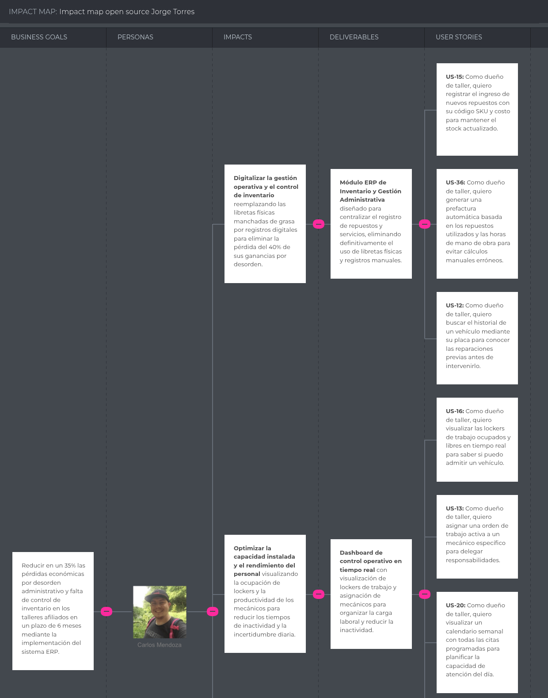
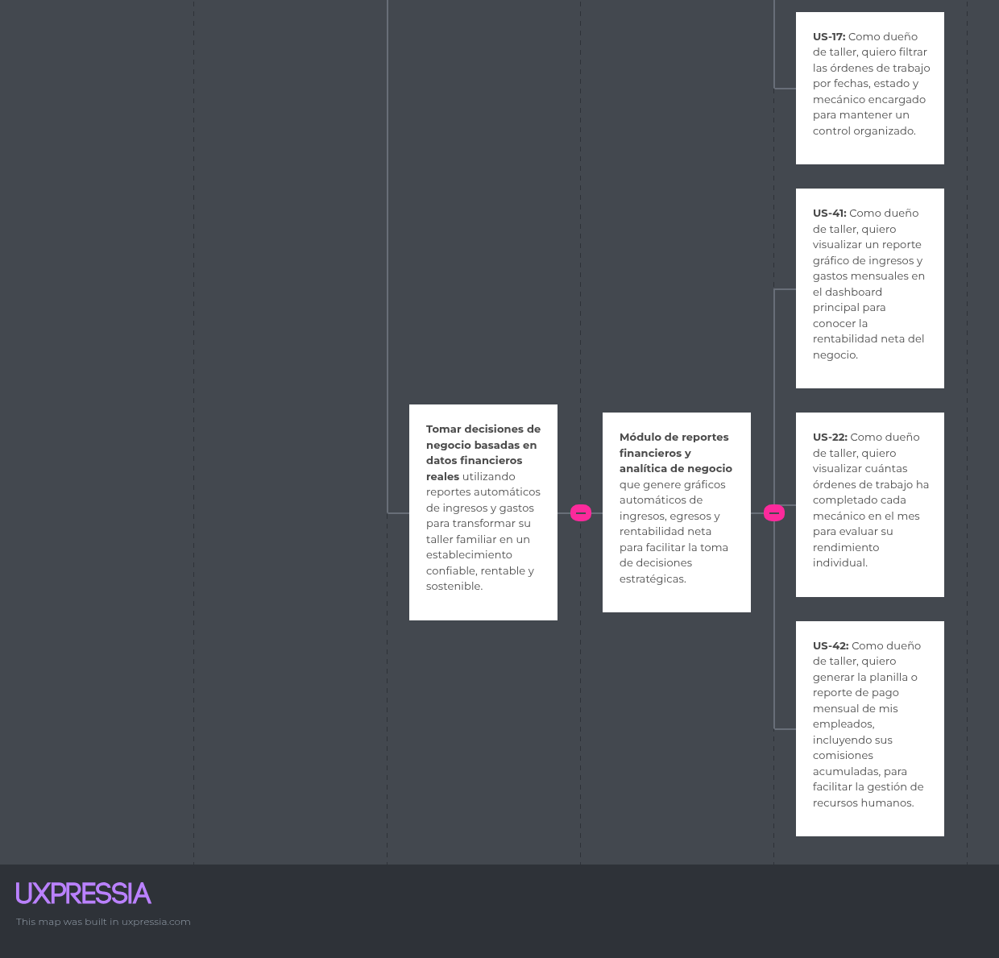

## 3.2. Impact Mapping {#cap-3-2}

**Segmento objetivo 1: Dueños o administradores de talleres automotrices independientes en Lima**

**Figura**

*Impact Mapping de dueños o administradores de talleres automotrices independientes en Lima*

<<<<<<< HEAD

=======

>>>>>>> 2b82365 (docs: add impact mapping and supporting diagrams.)

**Segmento objetivo 2: Conductores de vehículos de Lima**

**Figura**

*Impact Mapping de conductores de vehículos de Lima*

<<<<<<< HEAD

=======

>>>>>>> 2b82365 (docs: add impact mapping and supporting diagrams.)
