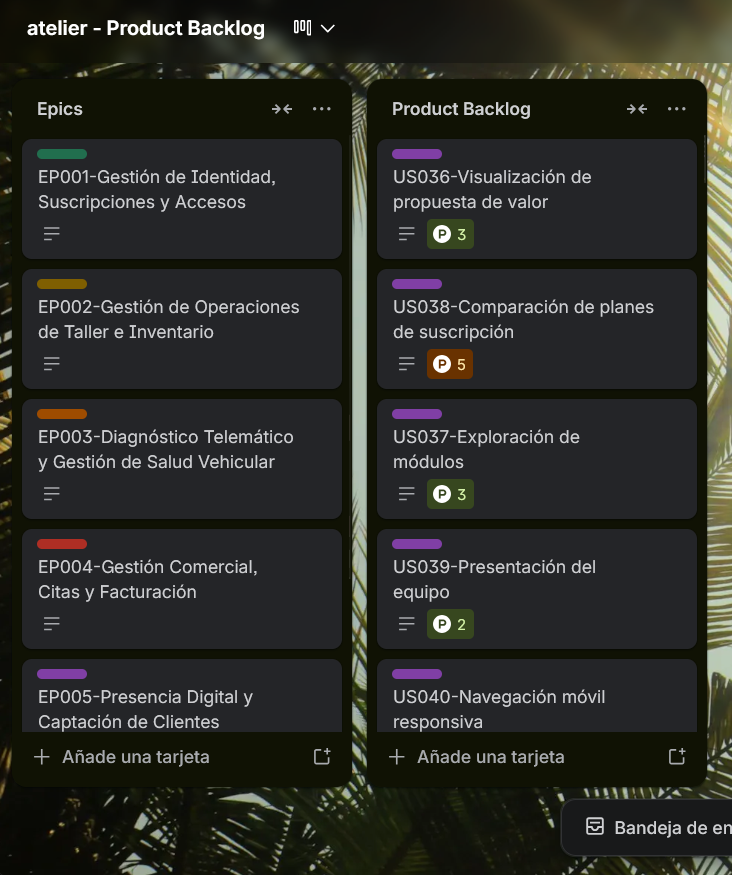

## 3.3. Product Backlog {#cap-3-3}

&emsp;&emsp;&emsp;&emsp;En esta sección se presenta la tabla del Product Backlog priorizado para la plataforma. Para estructurar este artefacto, se utilizaron puntos de historia que fueron asignados a cada historia de usuario creada, evaluando estrictamente su importancia para el contexto y valor del negocio. Para la estimación de estos puntos, el equipo utilizó la escala de Fibonacci.

&emsp;&emsp;&emsp;&emsp;Se decidió utilizar la herramienta Trello para la creación y gestión del Product Backlog. De este modo, la tabla inicia con las historias de usuario más importantes para el lanzamiento y operatividad del sistema, mientras que aquellas de menor importancia relativa se ubican en las últimas filas de dicha tabla.

**Tabla**

*Product Backlog de atelier*

| # Orden | User Story Id | Título                                 | Descripción                                                                                                                                         | Story Points (1 / 2 / 3 / 5 / 8) |
|---------|---------------|----------------------------------------|-----------------------------------------------------------------------------------------------------------------------------------------------------|----------------------------------|
| 1       | TS001         | Endpoints de Identidad y Talleres      | Como desarrollador backend, necesito implementar los endpoints/id_users y/wm, para manejar el aprovisionamiento multi-tenant.                       | 8                                |
| 2       | US001         | Registro inicial de taller             | Como dueño de taller, quiero registrar mi empresa, para crear un perfil oficial en la plataforma Atelier.                                           | 5                                |
| 3       | US003         | Inicio de sesión al sistema            | Como usuario registrado, quiero iniciar sesión de forma segura, para acceder a mi espacio de trabajo.                                               | 3                                |
| 4       | US002         | Selección de plan de suscripción       | Como dueño de taller, quiero seleccionar un plan de suscripción durante el registro, para habilitar las capacidades operativas correspondientes.    | 3                                |
| 5       | TS002         | API de Ingesta de Telemetría           | Como desarrollador backend, necesito implementar /vh_telemetry_batches y/vh, para soportar el alto volumen de datos IoT.                            | 8                                |
| 6       | US018         | Vinculación de hardware OBD2           | Como mecánico, quiero vincular un dispositivo OBD2 a un vehículo, para iniciar la captura de telemetría.                                            | 5                                |
| 7       | US020         | Visualización de telemetría en vivo    | Como mecánico, quiero visualizar la telemetría en vivo del vehículo, para evaluar la salud del motor con precisión.                                 | 8                                |
| 8       | TS003         | Transacción de Operaciones de Servicio | Como desarrollador backend, necesito gestionar/so_work_orders y/so tasks bajo un bloque transaccional, para asegurar la integridad atómica.         | 5                                |
| 9       | US014         | Creación de Orden de Trabajo           | Como administrador, quiero crear una Orden de Trabajo, para documentar el servicio requerido por el cliente.                                        | 5                                |
| 10      | US015         | Asignación de mecánicos a OT           | Como administrador, quiero asignar mecánicos específicos a una OT, para delegar las responsabilidades de reparación.                                | 2                                |
| 11      | US016         | Actualización de estado de Orden       | Como mecánico, quiero actualizar el estado de una OT, para que la recepción conozca el progreso de la reparación.                                   | 2                                |
| 12      | TS006         | Procesamiento del Patrón Outbox        | Como desarrollador backend, necesito implementar /sys_outbox, para garantizar la consistencia eventual de los eventos de dominio distribuidos.      | 5                                |
| 13      | TS005         | Procesamiento de Facturación y Pagos   | Como desarrollador backend, necesito conectar/bl invoices y/bl bl_payments, para consolidar la lógica financiera.                                   | 5                                |
| 14      | US028         | Registro de cobro en caja              | Como administrador, quiero registrar el pago de una orden de trabajo, para realizar el cuadre contable diario.                                      | 3                                |
| 15      | US026         | Creación de cotización digital         | Como administrador, quiero generar cotizaciones uniendo repuestos y servicios, para brindar precios transparentes.                                  | 5                                |
| 16      | US011         | Registro de nuevo cliente              | Como recepcionista, quiero registrar un cliente nuevo, para asociarlo a futuras transacciones.                                                      | 3                                |
| 17      | US024         | Agendamiento de citas                  | Como recepcionista, quiero agendar citas de mantenimiento, para organizar el flujo de ingresos de vehículos al taller.                              | 3                                |
| 18      | TS004         | Endpoints de Inventario y Stock        | Como desarrollador backend, necesito estructurar/iv_parts y/iv_ iv_stocks, para mantener el registro seguro de la cadena de suministro.             | 5                                |
| 19      | US008         | Alta de nuevos repuestos               | Como administrador, quiero registrar nuevos repuestos, para mantener un inventario digital estructurado.                                            | 3                                |
| 20      | US021         | Notificación de código DTC             | Como administrador, quiero recibir notificaciones por códigos de error (DTC), para identificar problemas mecánicos críticos al instante.            | 5                                |
| 21      | US022         | Listado de alertas predictivas         | Como administrador, quiero consultar un listado de alertas predictivas, para priorizar la atención de vehículos en riesgo.                          | 5                                |
| 22      | US004         | Registro de empleados                  | Como dueño de taller, quiero gestionar los perfiles de mis empleados, para que mi personal pueda acceder al sistema.                                | 3                                |
| 23      | US005         | Asignación de roles y permisos         | Como dueño de taller, quiero asignar roles a mis empleados, para restringir el acceso a módulos comerciales o financieros sensibles.                | 5                                |
| 24      | US009         | Ajuste manual de stock                 | Como administrador, quiero ajustar los niveles de stock, para que el sistema refleje el inventario fisico real.                                     | 2                                |
| 25      | US012         | Consulta de historial clínico          | Como mecánico, quiero consultar el historial de reparaciones de un vehículo, para diagnosticar de manera informada.                                 | 3                                |
| 26      | US023         | Historial de Telemetría                | Como mecánico, quiero consultar los datos históricos de telemetría, para analizar el comportamiento del motor en el tiempo.                         | 5                                |
| 27      | US010         | Alerta de stock mínimo                 | Como administrador, quiero establecer umbrales de stock mínimo, para recibir alertas preventivas de reposición.                                     | 3                                |
| 28      | US017         | Búsqueda y filtrado de inventario      | Como administrador, quiero aplicar filtros al catálogo, para encontrar rápidamente una pieza específica durante una reparación.                     | 2                                |
| 29      | US027         | Envío remoto de cotización             | Como administrador, quiero exportar la cotización, para enviársela al cliente a través de canales digitales.                                        | 2                                |
| 30      | US025         | Reprogramación de citas                | Como recepcionista, quiero modificar la fecha de una cita existente, para adaptarme a la disponibilidad del cliente.                                | 2                                |
| 31      | US029         | Panel de ingresos y rentabilidad       | Como dueño de taller, quiero visualizar métricas financieras comparativas, para evaluar el crecimiento mensual del negocio.                         | 5                                |
| 32      | US030         | Exportación de reportes contables      | Como dueño de taller, quiero exportar los movimientos del mes, para facilitar las declaraciones tributarias de mi contador.                         | 3                                |
| 33      | US019         | Desvinculación de escáner OBD2         | Como mecánico, quiero desvincular el dispositivo OBD2, para poder utilizar el hardware en otro automóvil.                                           | 2                                |
| 34      | US013         | Gestión de lockers de trabajo          | Como administrador, quiero asignar vehículos a los lockers de trabajo, para optimizar el espacio físico del taller.                                 | 2                                |
| 35      | US006         | Recuperación de contraseña             | Como usuario, quiero solicitar la recuperación de mi cuenta, para restablecer mi acceso en caso de olvido.                                          | 2                                |
| 36      | US007         | Edición de perfil de usuario           | Como usuario del sistema, quiero editar mi perfil personal, para mantener mi información de contacto actualizada.                                   | 1                                |
| 37      | US031         | Visualización de propuesta de valor    | Como visitante web, quiero visualizar claramente la propuesta de valor, para comprender los beneficios operativos del software.                     | 2                                |
| 38      | US032         | Exploración de módulos                 | Como visitante web, quiero leer sobre las capacidades del ERP y la telemetría, para evaluar la modernización de mi negocio.                         | 2                                |
| 39      | US033         | Comparación de planes de suscripción   | Como visitante web, quiero contrastar los planes de precios, para seleccionar el nivel que se ajuste a la capacidad de mi taller.                   | 2                                |
| 40      | US034         | Presentación del equipo                | Como visitante web, quiero conocer la identidad del equipo desarrollador (Andeva), para establecer confianza en la plataforma.                      | 1                                |
| 41      | US035         | Acceso a información legal             | Como visitante web, quiero revisar las políticas de privacidad y términos de servicio, para comprender el tratamiento de los datos telemáticos.     | 1                                |

&emsp;&emsp;&emsp;&emsp;A continuación de la tabla, se adjunta una imagen del Product Backlog diseñado originalmente en Trello, así como el enlace directo para acceder al tablero. Cabe recalcar que, dentro de cada tarjeta que contenga el código de una historia de usuario, se encuentra la descripción completa y detallada de dicha historia.

**Figura**

*Product Backlog de atelier en Trello*

Nota: Link de acceso a la plataforma de Trello [https://trello.com/invite/b/69e53a1f24bfdaee349e4ae0/ATTI7bbd33d5db1338ca2c51df8c95727a2a46CEA512/atelier](https://trello.com/invite/b/69e53a1f24bfdaee349e4ae0/ATTI7bbd33d5db1338ca2c51df8c95727a2a46CEA512/atelier)

