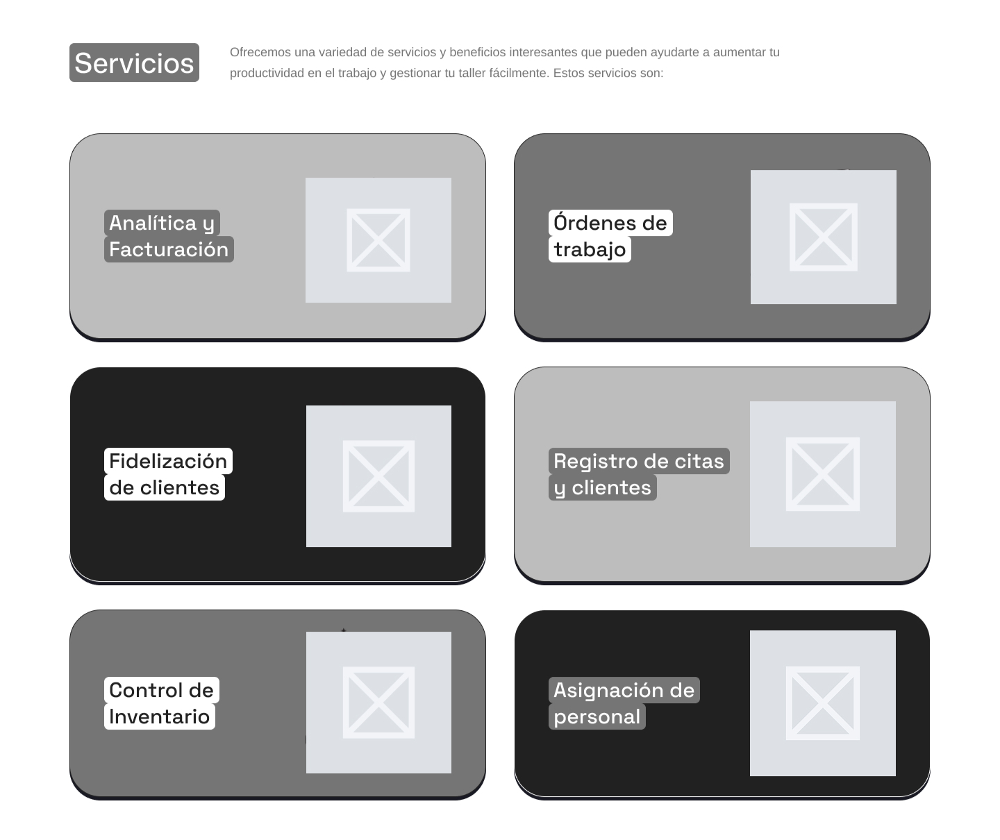
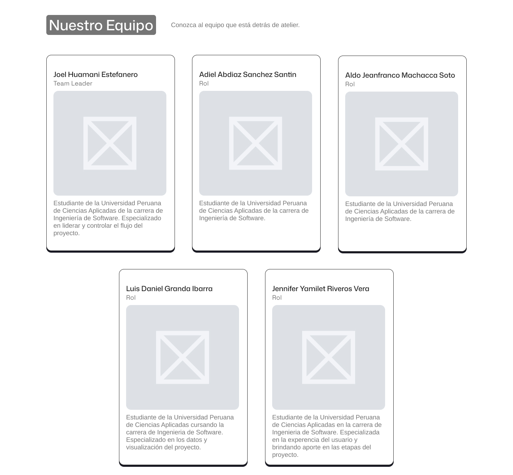
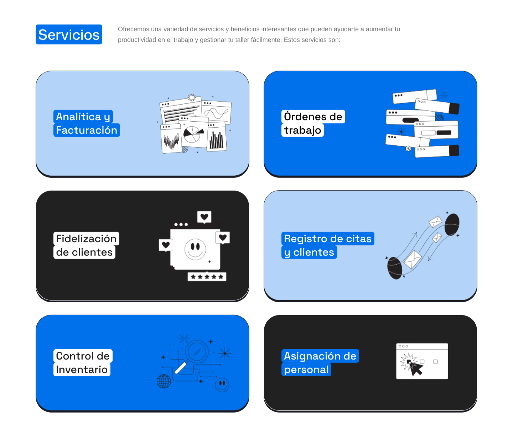
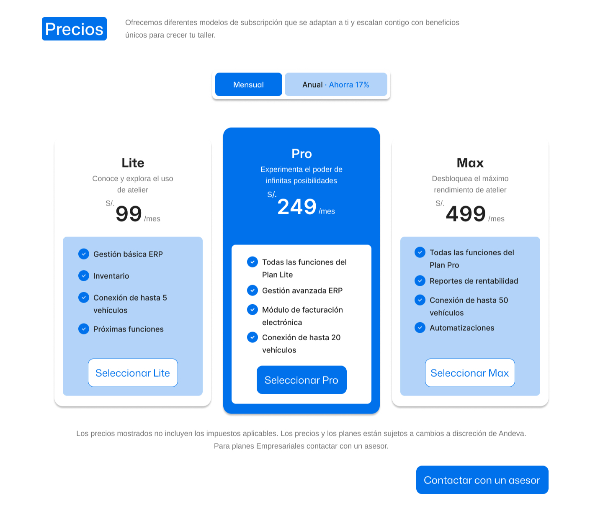
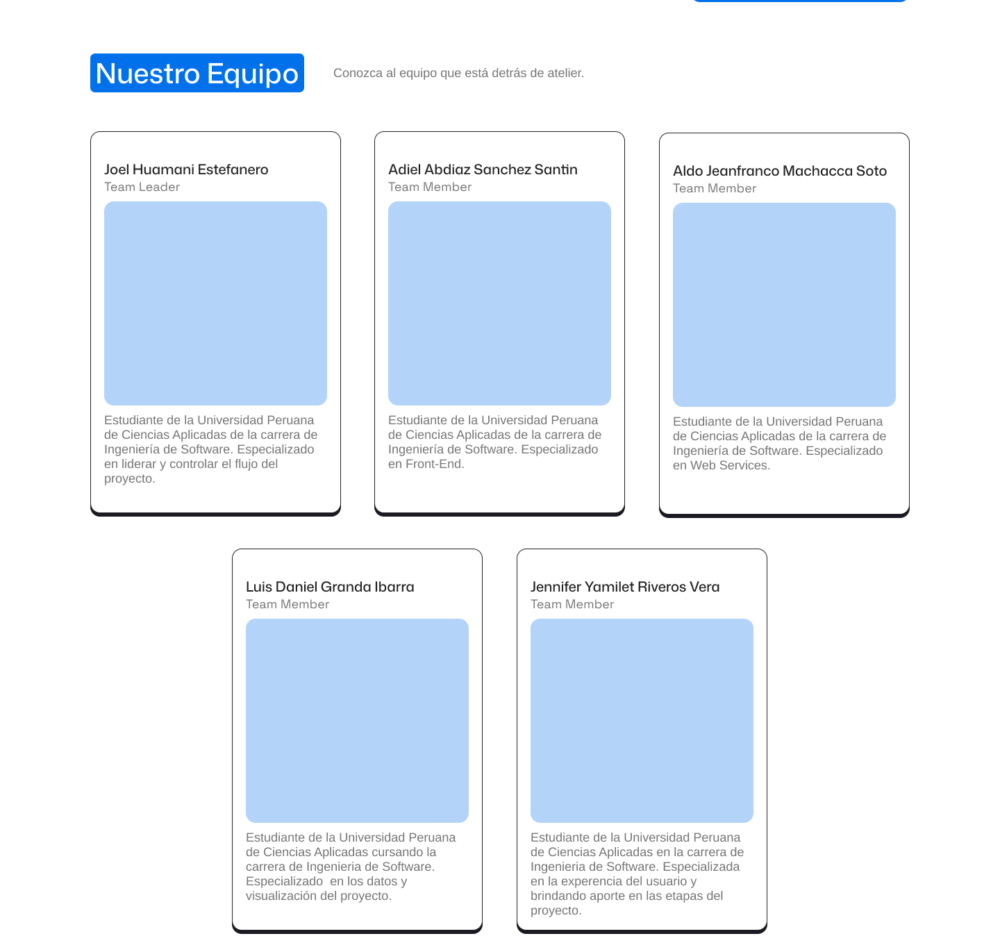

## 4.3. Landing Page UI Design {#cap-4-3}

### 4.3.1.&emsp;&emsp;*Landing Page Wireframe* {#cap-4-3-1}

&emsp;&emsp;&emsp;&emsp;Para el desarrollo del Landing Page, se realizo el wireframe con estructura y orden de la landing page en Figma.

**Figura 30**

*Wireframe del Landing Page de atelier*

### 4.3.2.&emsp;&emsp;*Landing Page Mock-up* {#cap-4-3-2}

&emsp;&emsp;&emsp;&emsp;Tambien se realizaron los mock-ups de la Landing Page con colores y tipografias adecuadas, definidas anteriormente.

**Figura 31**

*Mock-up del Landing Page de atelier*

