## 4.6. Domain-Driven Software Architecture {#cap-4-6}

&emsp;&emsp;&emsp;&emsp;En esta sección, el equipo parte de los logros alcanzados en Big Picture Event Storming para profundizar en la estructura técnica de la solución. A través de la perspectiva de Domain-Driven Design (DDD), se identifican los componentes tácticos esenciales como Bounded Contexts, Aggregates, Events, Commands y Queries, los cuales permiten alinear el software con las reglas de negocio del sector automotriz. Asimismo, se presenta la arquitectura del sistema mediante el modelo C4, desglosando la solución en niveles de Contexto, Contenedores y Componentes para garantizar una visión clara de la interoperabilidad y escalabilidad de "atelier".

### 4.6.1.&emsp;&emsp;*Design-Level Event Storming* {#cap-4-6-1}

&emsp;&emsp;&emsp;&emsp;El Design-Level Event Storming profundiza en los *Bounded Contexts* de la plataforma, conectando la visión general de negocio con la arquitectura técnica de software basada en *Domain-Driven Design* (DDD). A través de este proceso iterativo, modelamos con el mayor nivel de detalle los comandos, eventos, políticas y pantallas que dan vida al ecosistema predictivo y de gestión del taller.

**Paso 1: Collect Domain Events**

&emsp;&emsp;&emsp;&emsp;Se identificaron y colocaron secuencialmente todos los eventos de dominio clave (post-its naranjas) que representan cambios de estado inmutables en el sistema. Se mapearon eventos escritos en tiempo pasado, abarcando desde el registro inicial del taller (`TallerRegistrado`), pasando por la ingesta de telemetría (`LecturaRecibida`) y el flujo operativo (`OrdenAbierta`), hasta el cierre financiero (`FacturaEmitida`).

**Figura 48**

*Collect Domain Events*

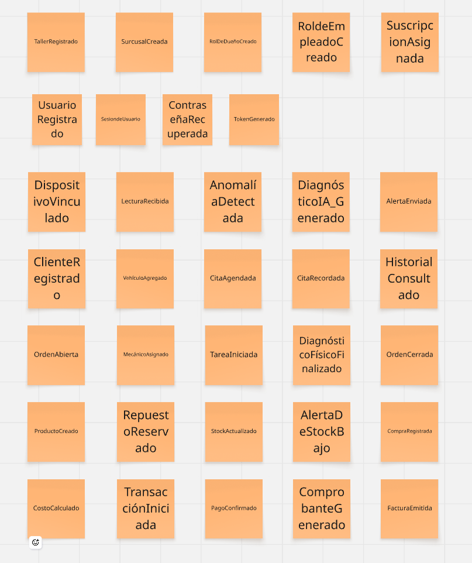

**Paso 2: Timelines y Bounded Contexts**

&emsp;&emsp;&emsp;&emsp;Una vez identificados todos los eventos, los organizamos en una línea de tiempo cronológica y los agrupamos en módulos delimitados (*frames*) para establecer nuestros sub-dominios. Identificamos 6 flujos claros alineados al diseño de software: Core (Identidad y Multi-tenencia), IoT (Hardware y Telemetría), Fleet (Gestión de Flota), Operations (Órdenes de Trabajo), Inventory (Almacén) y Billing (Facturación y Pagos).

**Figura 49**

*Timelines y Bounded Contexts*

**Paso 3: Commands y Actors**

&emsp;&emsp;&emsp;&emsp;En este paso, respondimos a la pregunta "¿Quién hace qué?". Agregamos los actores (post-its amarillos pequeños) como el Dueño, Conductor, Mecánico o Almacenero, junto con los comandos (post-its azules en infinitivo) que ellos ejecutan para detonar los eventos. Debido a la extensión del flujo técnico, este se visualiza en dos secciones.

**Figura 50**

*Commands y Actors - Parte 1*

**Figura X**

*Commands y Actors - Parte 2*

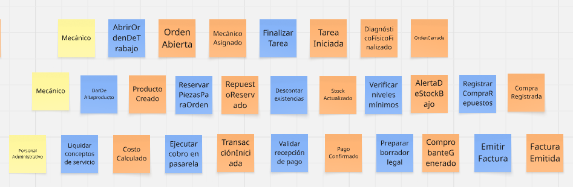

**Paso 4: Policies (Reglas de Negocio)**

&emsp;&emsp;&emsp;&emsp;Incorporamos las políticas del sistema (post-its lilas/morados), que representan las automatizaciones y reglas de negocio reactivas que conectan distintos contextos. Estas se redactan bajo la premisa "Siempre que pase X, hacer Y". Por ejemplo: *"Siempre que el sistema IoT detecte una anomalía, notificar al conductor para agendar una cita de mantenimiento"*.

**Figura 51**

*Policies - Parte 1*

**Figura X**

*Policies - Parte 2*

**Paso 5: Pain Points, External Systems y Read Models**

&emsp;&emsp;&emsp;&emsp;Añadimos las capas de interfaz de usuario, dependencias de terceros y análisis de riesgos. Colocamos los modelos de lectura (post-its verdes), que son las pantallas necesarias para la toma de decisiones. Además, integramos los sistemas externos (post-its rosados) como el Hardware OBD2, el Motor IA Andeva, la Pasarela de Pagos y la API de SUNAT.

**Figura 52**

*Read Models y External Systems - Parte 1*

**Figura X**

*Read Models y External Systems - Parte 2*

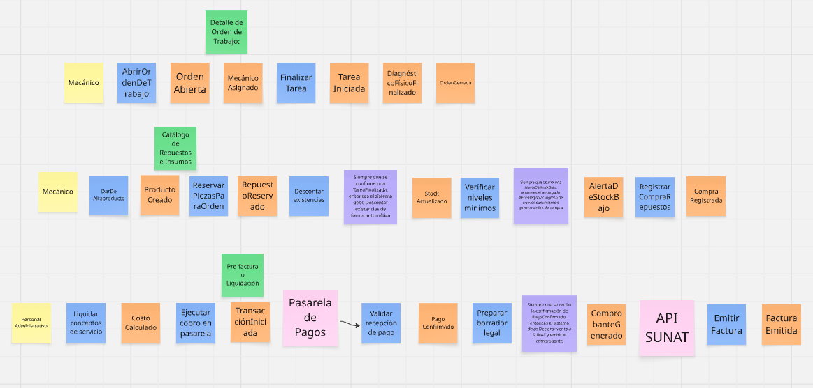

**Paso 6: Detalle de Bounded Contexts y Aggregates**

&emsp;&emsp;&emsp;&emsp;En la fase final, procedimos a identificar las entidades raíz o "Agregados" (post-its amarillos grandes) para cada contexto delimitado, asegurando la consistencia transaccional de cada módulo. A continuación, se detalla cada uno de los 6 Bounded Contexts definidos:

&emsp;&emsp;&emsp;&emsp;**a) Core:** Este contexto gestiona la identidad y el acceso multi-inquilino. Contiene los agregados `Tenant`, `Profile` y `Subscription`, encargados de vincular la identidad digital con la suscripción comercial del taller.

**Figura 53**

*Design-Level: Contexto de Core*

&emsp;&emsp;&emsp;&emsp;**b) IoT:** Representa el núcleo tecnológico predictivo. Se encarga de la ingesta de datos en el agregado `TelemetryRecord` y utiliza el agregado `Device` para gestionar el hardware vinculado a los vehículos.

**Figura 54**

*Design-Level: Contexto de IoT*

&emsp;&emsp;&emsp;&emsp;**c) Fleet:** Administra la relación con el cliente y su flota. Utiliza los agregados `Customer`, `Vehicle` y `Appointment` para coordinar las necesidades de mantenimiento preventivo.

**Figura 55**

*Design-Level: Contexto de Fleet*

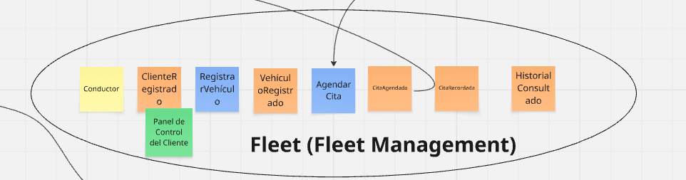

&emsp;&emsp;&emsp;&emsp;**d) Operations:** Es el corazón operativo del sistema. Todo el flujo gira en torno al agregado central `WorkOrder` y las tareas técnicas `MaintenanceTask`, controlando el ciclo de vida de la reparación.

**Figura 56**

*Design-Level: Contexto de Operations*

&emsp;&emsp;&emsp;&emsp;**e) Inventory:** Gestiona la integridad de los suministros del taller. Agrupa los agregados `Product` y `WarehouseItem` para el descuento automático de repuestos e insumos usados.

**Figura 57**

*Design-Level: Contexto de Inventory*

&emsp;&emsp;&emsp;&emsp;**f) Billing:** Maneja el cierre financiero y legal. Utiliza los agregados `PaymentTransaction` e `Invoice` para procesar cobros y emitir comprobantes electrónicos ante las entidades tributarias.

**Figura 58**

*Design-Level: Contexto de Billing*

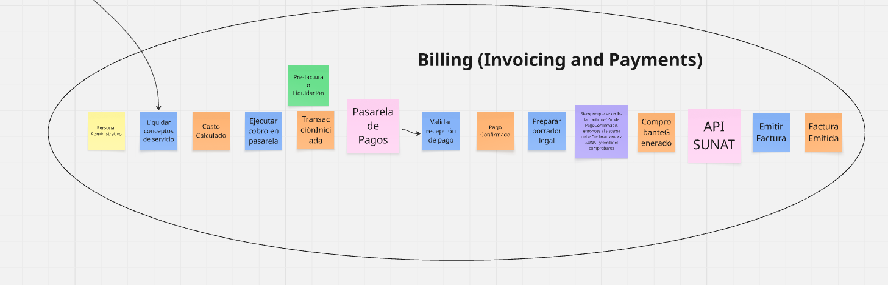

### 4.6.2. *Software Architecture Context Diagram* {#cap-4-6-2}

&emsp;&emsp;&emsp;&emsp;El diagrama de contexto proporciona una visión de alto nivel del sistema "atelier", situándolo en el centro de su ecosistema operativo. Este artefacto visualiza la interacción entre el sistema integral (ERP + IoT) y sus usuarios principales —dueños de taller, mecánicos y clientes finales— así como su dependencia de servicios externos críticos para la operación, como la pasarela de pagos, el sistema de facturación electrónica de SUNAT, las APIs de mensajería (WhatsApp y FCM) y el proveedor de identidad centralizado.

**Figura 59**

*Software Architecture Context Level Diagram*

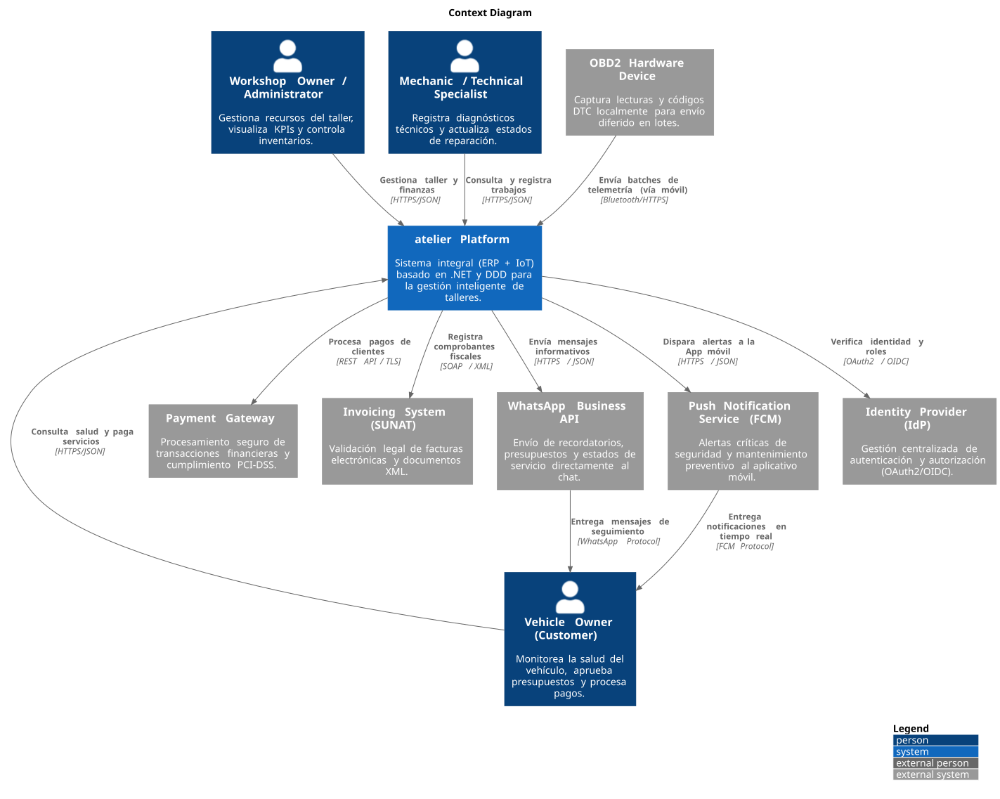

### 4.6.3. *Software Architecture Container Diagrams* {#cap-4-6-3}

&emsp;&emsp;&emsp;&emsp;El diagrama de contenedores descompone el sistema "atelier" en sus principales unidades de ejecución y almacenamiento, distribuyendo las responsabilidades técnicas de forma eficiente. En este nivel se presentan las aplicaciones web y móviles como puntos de entrada para los usuarios, el API Backend desarrollado en .NET 8/9 como núcleo de la lógica de dominio bajo los principios de DDD, y la infraestructura de soporte compuesta por la base de datos PostgreSQL y el broker de mensajería RabbitMQ para el manejo de eventos asíncronos.

**Figura 60**

*Software Architecture Container Level Diagram*

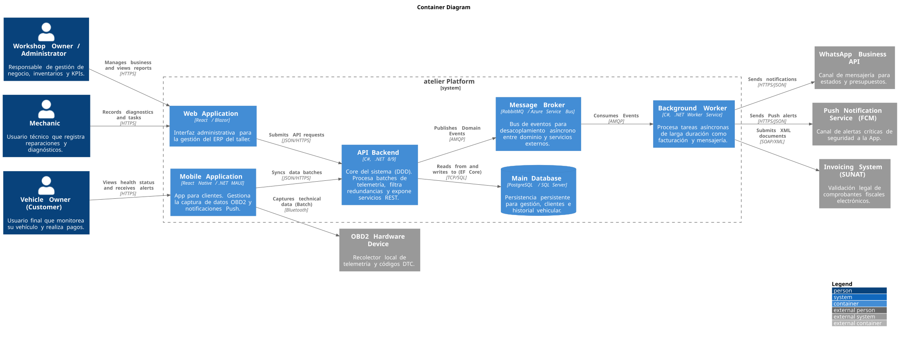

### 4.6.4. *Software Architecture Components Diagrams* {#cap-4-6-4}

&emsp;&emsp;&emsp;&emsp;En esta sección se detalla la descomposición interna de los contenedores para identificar sus bloques estructurales fundamentales y sus interacciones. A continuación, se presentan los diagramas de componentes para los contenedores principales del sistema.

**Component Diagram for "API Backend"**

&emsp;&emsp;&emsp;&emsp;A través del diagrama de componentes para el API Backend, se observa la orquestación de casos de uso mediante MediatR, los servicios de dominio dedicados al procesamiento de telemetría OBD2 y los adaptadores de infraestructura para persistencia y publicación de eventos, reflejando una arquitectura modular preparada para el crecimiento del negocio.

**Figura 61**

*Software Architecture Component Level Diagram - API Backend*

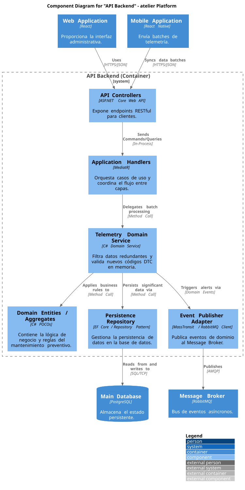

**Component Diagram for "Web Application"**

&emsp;&emsp;&emsp;&emsp;En el diagrama de componentes de la Web Application, se estructuran los módulos principales que permiten la gestión del taller. Se utiliza Vue Router para la navegación, y componentes clave para la agenda, inventario, facturación y visor de telemetría. Todos estos se comunican con el API Backend a través de un cliente API centralizado.

**Figura 62**

*Software Architecture Component Level Diagram - Web Application*

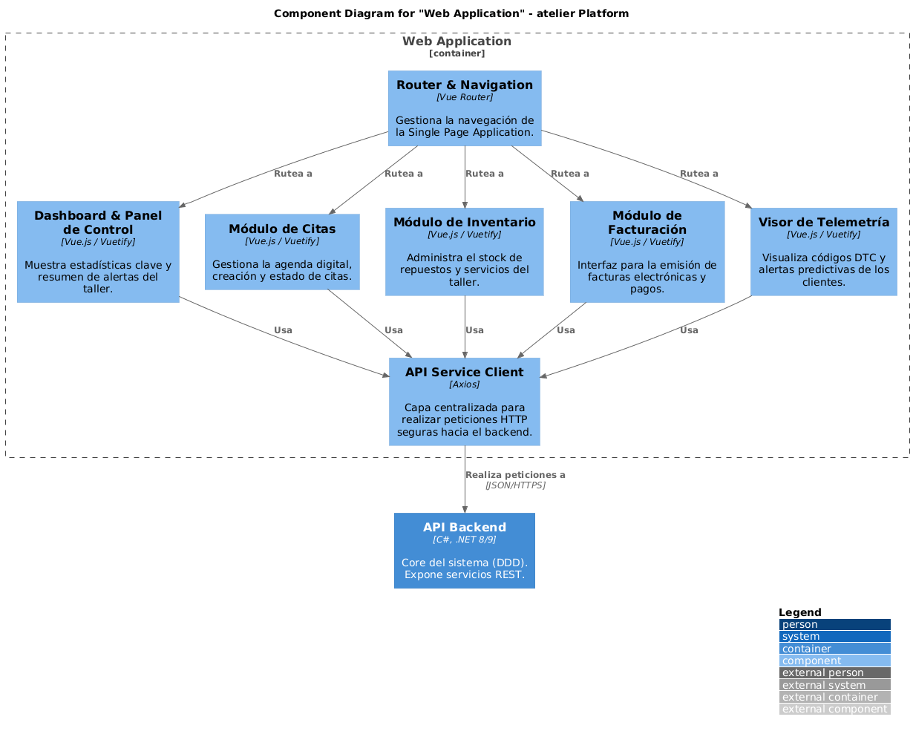

**Component Diagram for "Mobile Application"**

&emsp;&emsp;&emsp;&emsp;El diagrama de la Mobile Application detalla cómo la aplicación móvil interactúa con el conductor y el vehículo. Destaca el servicio Bluetooth para la conexión OBD2, el sincronizador de telemetría que envía los batches de datos, y el gestor de notificaciones push para las alertas de seguridad, todo apoyado por el cliente de la API móvil.

**Figura 63**

*Software Architecture Component Level Diagram - Mobile Application*

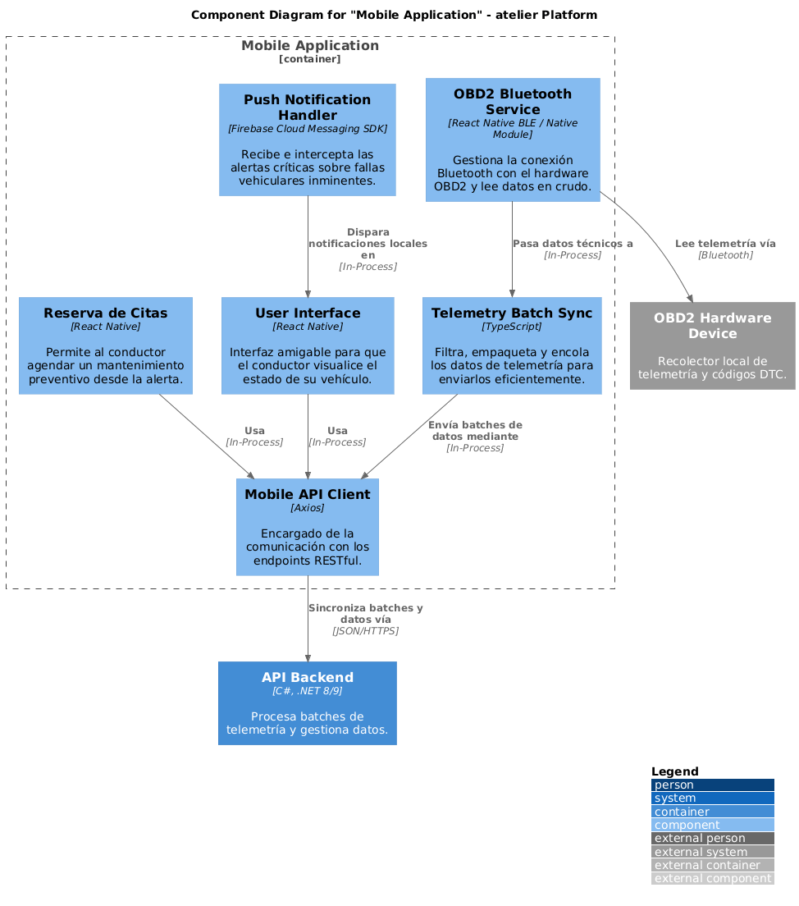

**Component Diagram for "Background Worker"**

&emsp;&emsp;&emsp;&emsp;Finalmente, el diagrama del Background Worker muestra la infraestructura asíncrona del sistema. Éste consume eventos desde RabbitMQ y orquesta tareas pesadas como la generación de facturas XML para la SUNAT y el envío de notificaciones mediante WhatsApp Business API y FCM, desacoplando así estas responsabilidades del flujo principal.

**Figura 64**

*Software Architecture Component Level Diagram - Background Worker*

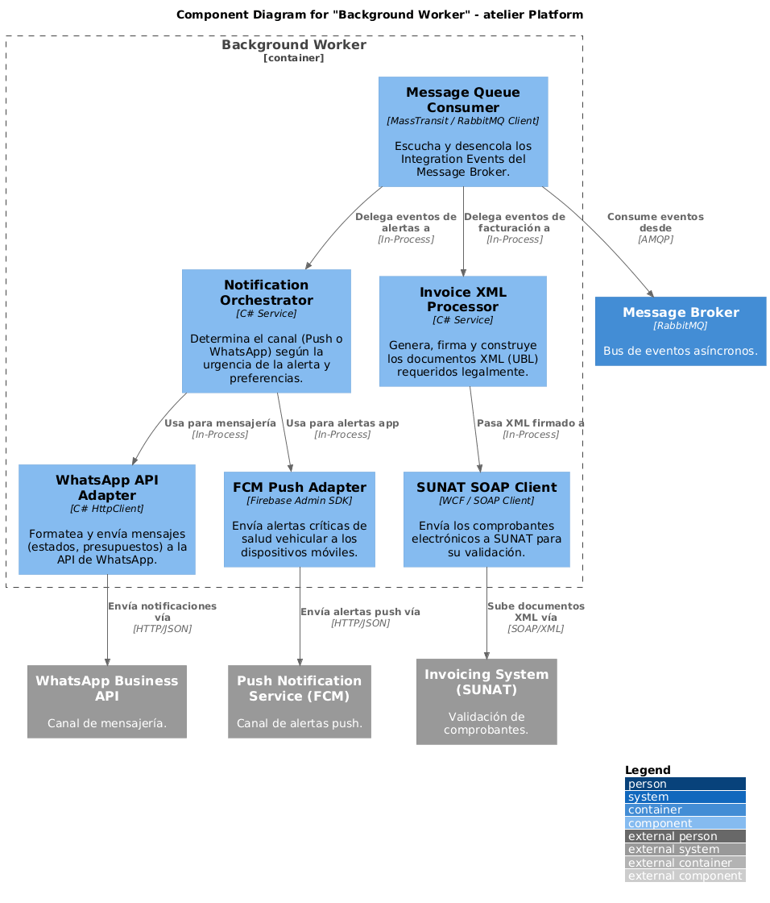

**Figura 65**

*Software Architecture Component Level Diagram*

