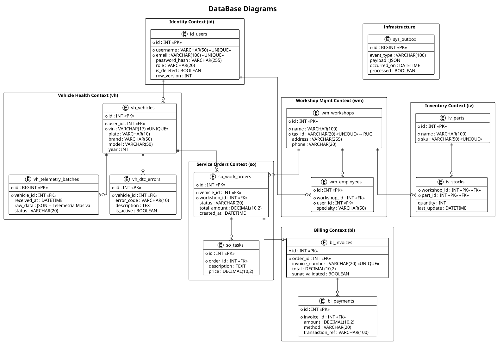
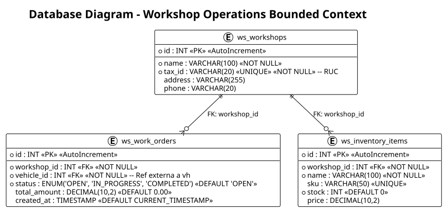

## 4.8. Database Design {#cap-4-8}

&emsp;&emsp;&emsp;&emsp;En esta sección, el equipo presenta el diseño de la base de datos de "atelier", el cual ha sido estructurado siguiendo un modelo relacional que garantiza la integridad, consistencia y persistencia de la información necesaria para el funcionamiento de la plataforma. El diseño se alinea estrechamente con los principios de Domain-Driven Design (DDD), particionando la persistencia según los Bounded Contexts identificados en la arquitectura de software. Esta aproximación permite una evolución independiente de los módulos y facilita la escalabilidad del sistema al minimizar el acoplamiento a nivel de datos.

&emsp;&emsp;&emsp;&emsp;Se ha optado por un modelo relacional para manejar las interacciones complejas entre usuarios, vehículos, inventarios y órdenes de servicio. La implementación asegura el cumplimiento de las reglas de negocio mediante el uso de llaves primarias (PK), llaves foráneas (FK), restricciones de unicidad (UNIQUE) y tipos de datos precisos para cada atributo. Además, se han incluido mecanismos de control de concurrencia y auditoría básica, como versiones de fila y marcas de tiempo de creación, para robustecer la gestión de la información en un entorno multiusuario.

### 4.8.1. Database Diagrams {#cap-4-8-1}

&emsp;&emsp;&emsp;&emsp;En esta sección el equipo presenta y explica el Database Diagram que incluye los objetos de base de datos que permitirán la persistencia de información para los objetos de cada bounded context. A continuación, se muestra el diagrama general que integra los distintos contextos de la solución.

**Figura 73**

*Database Diagram General de la solución atelier*

&emsp;&emsp;&emsp;&emsp;A continuación, se detallan los diagramas específicos para cada Bounded Context, especificando las tablas, columnas, constraints y las relaciones que evidencian la persistencia de los objetos de dominio.

#### 4.8.1.1. Identity & Access Context (ID) {#cap-4-8-1-1}

&emsp;&emsp;&emsp;&emsp;Este contexto se encarga de la gestión de usuarios y el control de acceso basado en roles. La persistencia se centra en la seguridad y la identificación única de cada actor en el sistema.

**Figura 74**

*Database Diagram - Identity & Access Context (id)*

.svg "Database Diagram - Identity & Access Context (id)")

*   **id_users**: Tabla principal que almacena las credenciales y el rol de los usuarios. Incluye restricciones de unicidad para `username` y `email`, y gestiona el borrado lógico mediante `is_deleted`.

#### 4.8.1.2. Vehicle Health Context (VH) {#cap-4-8-1-2}

&emsp;&emsp;&emsp;&emsp;Este contexto gestiona la información técnica de los vehículos y la persistencia de los datos de telemetría e incidencias mecánicas recolectadas.

**Figura 75**

*Database Diagram - Vehicle Health Context (vh)*

.svg "Database Diagram - Vehicle Health Context (vh)")

*   **vh_vehicles**: Almacena los datos maestros de los vehículos vinculados a un usuario.
*   **vh_telemetry_batches**: Registra lotes de datos crudos (JSON) provenientes del dispositivo OBD2 para su posterior procesamiento.
*   **vh_dtc_errors**: Persiste los códigos de error detectados (Diagnostic Trouble Codes), permitiendo un historial de fallas del vehículo.

#### 4.8.1.3. Inventory Management Context (IV) {#cap-4-8-1-3}

&emsp;&emsp;&emsp;&emsp;Responsable de controlar el catálogo de repuestos y los niveles de stock disponibles en cada taller afiliado.

**Figura 76**

*Database Diagram - Inventory Management Context (iv)*

.svg "Database Diagram - Inventory Management Context (iv)")

*   **iv_parts**: Catálogo general de repuestos con especificaciones técnicas y precios base.
*   **iv_stocks**: Relaciona las partes con los talleres, controlando la cantidad disponible y los niveles mínimos para alertas de reabastecimiento.

#### 4.8.1.4. Service & Work Orders Context (SO) {#cap-4-8-1-4}

&emsp;&emsp;&emsp;&emsp;Gestiona el ciclo de vida de los servicios realizados en el taller, desde la apertura de la orden hasta su finalización y cobro.

**Figura 77**

*Database Diagram - Service & Work Orders Context (so)*

.svg "Database Diagram - Service & Work Orders Context (so)")

*   **so_work_orders**: Tabla cabecera de las órdenes de servicio, vinculando el vehículo, el taller y el estado actual de la reparación.
*   **so_tasks**: Detalle de las tareas o servicios específicos realizados dentro de una orden, asignando un mecánico y un costo.

#### 4.8.1.5. Workshop Operations Context (WO) {#cap-4-8-1-5}

&emsp;&emsp;&emsp;&emsp;Este contexto maneja la información operativa del taller y su infraestructura básica necesaria para la gestión administrativa.

**Figura 78**

*Database Diagram - Workshop Operations Bounded Context*

*   **ws_workshops**: Contiene la información legal y de contacto de los talleres (nombre, RUC, dirección).
*   **ws_inventory_items** y **ws_work_orders**: Representan las entidades operativas dentro del contexto del taller, asegurando que la gestión diaria se realice de forma fluida y centralizada.
