## 5.2. Landing Page, Services & Applications Implementation {#cap-5-2}

### 5.2.1.&emsp;&emsp;*Sprint 1* {#cap-5-2-1}

#### 5.2.1.1.&emsp;&emsp;*Sprint Planning 1* {#cap-5-2-1-1}

&emsp;&emsp;&emsp;&emsp;En esta sección se especifican los aspectos principales del Sprint Planning Meeting para el primer sprint del proyecto atelier. El objetivo central de esta iteración está enfocado exclusivamente en el desarrollo, maquetación y despliegue de la Landing Page, la cual servirá como la principal herramienta de captación de clientes y presentación de la propuesta de valor.

&emsp;&emsp;&emsp;&emsp;A continuación, se presenta el cuadro de resumen del sprint planning meeting siguiendo la estructura establecida:

**Tabla**

*Tabla de Sprint 1 de atelier*

| Sprint # | Sprint 1 |
|:--------:|:--------|
|    **Sprint Planning Background**      |    --      |
|    Date      |    2026-04-21      |
|    Time      |    07:00 PM      |
|    Location      |    Reunión virtual mediante el canal de voz de Discord      |
|    Prepared By      |     Huamani Estefanero, Joel     |
|    Attendees     |     Huamani Estefanero, Joel/Granda Ibarra, Luis Daniel/Machacca Soto, Aldo Jeanfranco/Riveros Vera, Jennifer Yamilet/Sanchez Santin, Adiel Abdiaz     |
|    Sprint 1 – 1 Review Summary      |    --      |
|    Sprint 1 – 1 Retrospective Summary      |     --     |
|     **Sprint Goal & User Stories**     |          |
|     Sprint 1 Goal     |     Our focus is on offering a comprehensive and attractive initial digital presence through a fully functional landing page for the atelier platform. We believe it delivers a clear understanding of the ERP and IoT value proposition, transparent comparison of subscription plans, and trust in the brand to our target audience. This will be confirmed when visitors access the site to seamlessly navigate through the service modules across different devices, read the legal policies, and interact with the landing page.     |
|     Sprint 1 Velocity     |     22     |
|     Sum of Story Points     |   20       |

#### 5.2.1.2.&emsp;&emsp;*Aspect Leaders and Collaborators* {#cap-5-2-1-2}

&emsp;&emsp;&emsp;&emsp;Dado que el objetivo exclusivo de este primer sprint es la construcción de la Landing Page de Atelier, los principales aspectos que se toman en cuenta corresponden a los subconjuntos del alcance funcional. Estos aspectos son: Propuesta de Valor, Exploración de Módulos, Planes de Suscripción, Presentación del Equipo y Información Legal y Footer.

**Tabla**

*Leadership-and-Collaboration Matrix*

| Team Member | GitHub Username | Propuesta de Valor | Exploración de Módulos | Planes de Subcripción | Presentación de Equipo | Información Legal y Footer |
|:-----------:|:---------------:|--------------------|------------------------|-----------------------|------------------------|----------------------------|
|      Granda Ibarra, Luis Daniel       |      danieltyuyu           |                    |          L              |                       |                        |                            |
|     Huamani Estefanero, Joel        |       shouydev          |        L            |        C                |                       |            C            |          C                  |
|    Machacca Soto, Aldo Jeanfranco         |       AldoDev20          |                    |                        |     L                  |                        |                            |
|     Riveros Vera, Jennifer Yamilet        |     Jennivz            |                    |                        |                       |                        |              L             |
|      Sanchez Santin, Adiel Abdiaz       |      xs4el           |                    |                        |                       |             L           |                            |

#### 5.2.1.3.&emsp;&emsp;*Sprint Backlog 1* {#cap-5-2-1-3}

&emsp;&emsp;&emsp;&emsp;Como se estableció en el Sprint Planning, el objetivo principal de este primer sprint es el desarrollo, maquetación y despliegue de la primera versión funcional de la Landing Page de Atelier. Esto implica implementar todas las secciones visuales que comuniquen la propuesta de valor, los planes de suscripción, el equipo desarrollador y la adaptabilidad móvil.

&emsp;&emsp;&emsp;&emsp;A continuación, se presenta una captura de pantalla del sprint backlog en la herramienta de gestión Trello, junto con su respectivo enlace público: [https://trello.com/invite/b/69e53a1f24bfdaee349e4ae0/ATTI7bbd33d5db1338ca2c51df8c95727a2a46CEA512/atelier](https://trello.com/invite/b/69e53a1f24bfdaee349e4ae0/ATTI7bbd33d5db1338ca2c51df8c95727a2a46CEA512/atelier).

&emsp;&emsp;&emsp;&emsp;Seguidamente, se detalla la tabla de control de estado con la descomposición de las User Stories en tareas específicas asignadas a los miembros del equipo, estimadas en horas y con su estado actual de progreso.

**Tabla**

*Sprint Backlog #1 atelier*

| Sprint #   | Sprint 1                             |                  |                                |                                                                                                    |                    |                |                                                |
|------------|--------------------------------------|------------------|--------------------------------|----------------------------------------------------------------------------------------------------|--------------------|----------------|------------------------------------------------|
| User Story |                                      | Work-Item / Task |                                |                                                                                                    |                    |                |                                                |
| Id         | Title                                | Id               | Title                          | Description                                                                                        | Estimation (Hours) | Assigned To    | Status (To-do / In-Process / To-Review / Done) |
| US036      | Visualización de propuesta de valor  | T01              | Maquetar Hero Section          | Desarrollar la estructura HTML de la cabecera principal con el titular de la propuesta de valor.   | 2                  | Joel Huamani   | Done                                           |
|            |                                      | T02              | Aplicar estilos a Hero         | Aplicar CSS utilizando la paleta de colores de la marca y la tipografía Mona Sans.                 | 2                  | Joel Huamani | Done                                           |
|            |                                      | T03              | Implementar CTA                | Diseñar y configurar el botón de ""Call to Action"" principal en la vista de inicio.               | 1                  | Joel Huamani   | Done                                           |
| US037      | Exploración de módulos               | T04              | Maquetar tarjetas de servicios | Construir la cuadrícula (grid) para mostrar los beneficios del ERP y la telemetría IoT.            | 2                  | Luis Granda | Done                                           |
|            |                                      | T05              | Insertar recursos gráficos     | Seleccionar y optimizar los íconos/imágenes representativas de cada servicio.                      | 1.5                | Luis Granda  | Done                                           |
|            |                                      | T06              | Estilizar layout de servicios  | Aplicar estilos CSS para asegurar el correcto espaciado (padding/margin) de los módulos.           | 2                  | Luis Granda | Done                                           |
| US038      | Comparación de planes de suscripción | T07              | Crear tabla de precios         | Estructurar en HTML las tarjetas comparativas para los planes Lite, Pro, Max y Empresarial.        | 2.5                | Aldo Machacca  | Done                                           |
|            |                                      | T08              | Detallar beneficios por plan   | Redactar e insertar las listas de características habilitadas para cada nivel de suscripción.      | 1.5                | Aldo Machacca | Done                                           |
|            |                                      | T09              | Estilos de contraste en planes | Aplicar CSS para destacar el plan más popular (Premium/Max) visualmente.                           | 2                  | Aldo Machacca  | Done                                           |
| US039      | Presentación del equipo              | T10              | Maquetar sección Team          | Crear la estructura base para la presentación de los desarrolladores de Andeva.                    | 1.5                | Adiel Sanchez | Done                                           |
|            |                                      | T11              | Cargar perfiles                | Insertar las fotografías, nombres y roles de cada miembro del equipo.                              | 1                  | Adiel Sanchez | Done                                           |
|            |                                      | T12              | Estilizar tarjetas de perfil   | Aplicar estilos visuales a las tarjetas de los miembros para mantener consistencia.                | 1.5                | Adiel Sanchez | Done                                           |
| US040      | Navegación móvil responsiva          | T13              | Responsive: Hero y Servicios   | Configurar media queries en CSS para adaptar la cabecera y los módulos a pantallas pequeñas.       | 2                  | Joel Huamani   | Done                                           |
|            |                                      | T14              | Responsive: Planes de precio   | Modificar la visualización de la tabla de precios para que se apile verticalmente en móviles.      | 2                  | Aldo Machacca  | Done                                           |
|            |                                      | T15              | Responsive: Team y Footer      | Ajustar la cuadrícula del equipo y el pie de página para su correcta visualización en smartphones. | 2                  | Adiel Sanchez | Done                                           |
| US041      | Acceso a información legal           | T16              | Maquetar Footer general        | Desarrollar la estructura semántica inferior de la página (Pie de página).                         | 1.5                | Jennifer Riveros | Done                                           |
|            |                                      | T17              | Insertar hipervínculos legales | Redactar e integrar los enlaces a Términos y Condiciones y Políticas de Privacidad.                | 1                  | Jennifer Riveros   | Done                                           |
|            |                                      | T18              | Estilizar Footer               | Aplicar colores de fondo (Dark Primary) y asegurar alineación del contenido.                       | 1                  | Jennifer Riveros | Done                                           |

#### 5.2.1.4.&emsp;&emsp;*Development Evidence for Sprint Review* {#cap-5-2-1-4}

&emsp;&emsp;&emsp;&emsp;En esta sección se explican y presentan los avances en implementación correspondientes al primer sprint del proyecto Atelier. De acuerdo con el alcance establecido en el Sprint Planning para esta iteración inicial, el esfuerzo del equipo de desarrollo se centró exclusivamente en el producto correspondiente a la Landing Page.

&emsp;&emsp;&emsp;&emsp;A continuación, se presenta la tabla detallada que incluye, para el repositorio del sitio web estático, los commits directamente relacionados con la implementación de las características mencionadas:

**Tabla**

*Tabla de Commits del Sprint #1*

| Repository | Branch | Commit Id | Commit Message | Commit Message Body | Commited On |
|:----------:|:------:|-----------|----------------|---------------------|-------------|
|     andeva-upc/atelier-website-11848       |   main     |     e37d811c      |        chore: initial commit.        |                     |      23/04/2026 21:09       |
|     andeva-upc/atelier-website-11848       |  develop      |     8f5cc348      |         feat(header): add header component with logo and buttons.       |                     |      23/04/2026 21:10       |
|     andeva-upc/atelier-website-11848       |    develop    |     3a33c131      |       feat(value-proposition): add hero component with title, subtitle, and buttons.         |                     |     23/04/2026 21:10        |
|     andeva-upc/atelier-website-11848       |    develop    |    ed19969b       |        feat(benefits): add card component with animation and styling.        |                     |        25/04/2026 11:22     |
|     andeva-upc/atelier-website-11848       |    develop    |      1eeb92b5     |         feat: add services section with polished UI and clean code architecture.       |                     |     25/04/2026 11:25        |
|     andeva-upc/atelier-website-11848       |    develop    |    433ab75a       |      feat(pricing): create pricing component structure and integrate into app.          |                     |      25/04/2026 11:45       |
|     andeva-upc/atelier-website-11848       |   develop     |     5cd81595      |        feat(pricing): implement pricing cards UI with color palette and content.        |                     |      25/04/2026 11:48       |
|     andeva-upc/atelier-website-11848       |    develop    |     9daeb4bc      |         feat(pricing): add responsive design and interactive polish to pricing section.       |                     |    25/04/2026 12:27         |
|     andeva-upc/atelier-website-11848       |    develop    |     ea2b48a6      |       feat(team): add team section with member profiles.         |                     |      25/04/2026 15:39       |
|     andeva-upc/atelier-website-11848       |   develop     |     4d0b353d      |        feat(footer): add landing page footer.        |                     |       25/04/2026 23:55      |
|     andeva-upc/atelier-website-11848       |   develop     |      7e22b4a6     |        feat(footer): integrate footer into landing page.        |                     |       26/04/2026 00:03      |
|     andeva-upc/atelier-website-11848       |   main     |      release/website atelier version 1.0.0     |                |                     |      26/04/2026 08:47       |

#### 5.2.1.5.&emsp;&emsp;*Execution Evidence for Sprint Review* {#cap-5-2-1-5}

&emsp;&emsp;&emsp;&emsp;Esta sección inicia con un resumen detallado de los objetivos alcanzados durante el primer sprint del proyecto Atelier. Durante esta iteración, el esfuerzo del equipo se enfocó exitosamente en el desarrollo e implementación de la primera versión funcional de la Landing Page. Se logró construir y estilizar las interfaces visuales clave para el embudo de captación comercial, abarcando la cabecera principal con la propuesta de valor, la cuadrícula de exploración de los módulos, la tabla comparativa de planes de suscripción, la presentación del equipo desarrollador y el pie de página con accesos legales. Asimismo, se garantizó un diseño completamente responsivo para una correcta adaptabilidad en dispositivos móviles y de escritorio.

&emsp;&emsp;&emsp;&emsp;A continuación, se presentan las capturas de pantalla de las principales vistas implementadas, junto con un enlace a un video demostrativo que ilustra y explica a detalle la visualización y navegación logrados en este Sprint: .

**Figura**

*Capturas de Pantalla de la Landing Page de atelier*

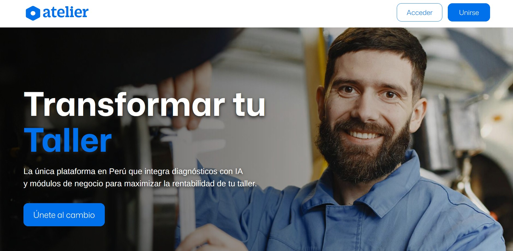
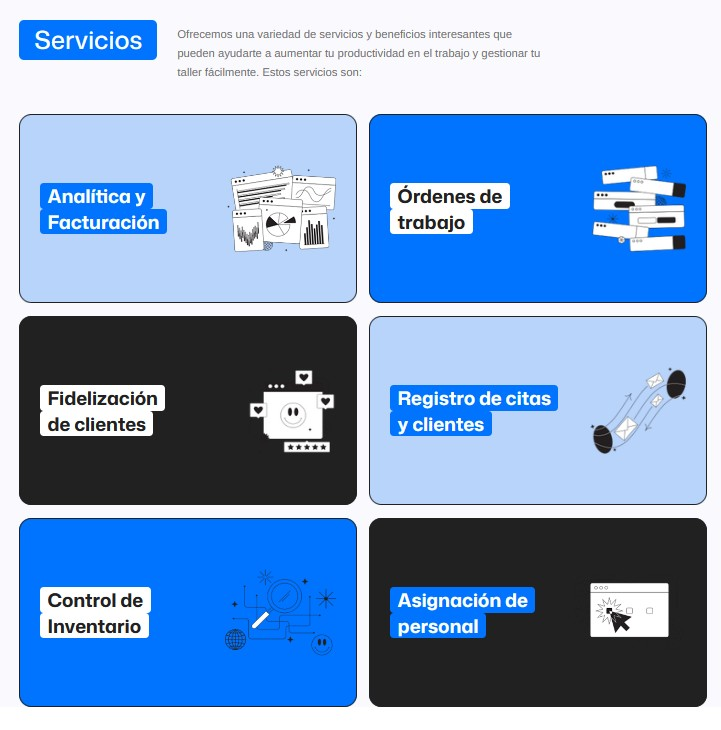

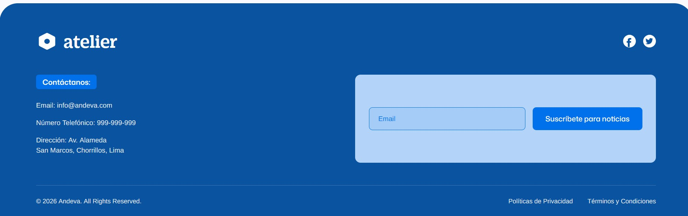

#### 5.2.1.6.&emsp;&emsp;*Services Documentation Evidence for Sprint Review* {#cap-5-2-1-6}

&emsp;&emsp;&emsp;&emsp;En este primer sprint, de acuerdo con el Sprint Goal y la planificación establecida, el esfuerzo y el alcance técnico se centraron de manera exclusiva en el desarrollo, maquetación y despliegue del Landing Page de la plataforma atelier.

&emsp;&emsp;&emsp;&emsp;Por consiguiente, durante esta iteración inicial no se ha desarrollado, integrado ni desplegado ningún Web Service o API RESTful. La implementación y documentación técnica de endpoints mediante OpenAPI, así como la tabla de acciones y sintaxis de llamadas requerida, comenzarán a elaborarse y evidenciarse a partir de los siguientes sprints, una vez que el equipo inicie el desarrollo arquitectónico de la aplicación Backend.

#### 5.2.1.7.&emsp;&emsp;*Software Deployment Evidence for Sprint Review* {#cap-5-2-1-7}

&emsp;&emsp;&emsp;&emsp;En esta sección se resumen los procesos realizados en relación con el despliegue durante el primer sprint del proyecto atelier. De acuerdo con los objetivos trazados en el Sprint Planning, el alcance técnico de esta iteración se limitó exclusivamente a la construcción del Landing Page. Por consiguiente, durante este periodo no se realizaron despliegues vinculados a las Web Applications ni a los Web Services.

&emsp;&emsp;&emsp;&emsp;Las actividades de despliegue para este primer sprint abarcaron la configuración del repositorio oficial del proyecto y la habilitación de recursos en el cloud provider seleccionado: GitHub Pages. Al tratarse de una arquitectura estática, este proveedor permite una automatización directa y una integración continua del alojamiento web directamente desde el repositorio.

&emsp;&emsp;&emsp;&emsp;Paso 1: Integración de la rama de lanzamiento. Como paso inicial, el equipo consolidó todos los avances de diseño y maquetación de las distintas ramas de características hacia la rama principal de despliegue. Esto asegura que el código a desplegar sea la versión estable y aprobada del Sprint.

**Figura**

*Repositorio del website de atelier*

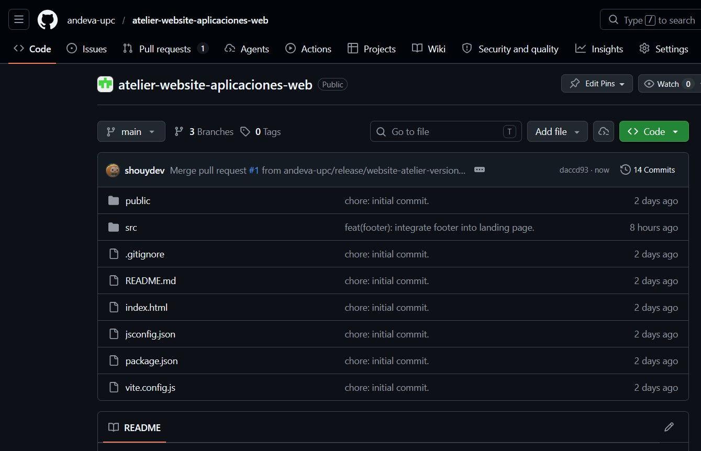

&emsp;&emsp;&emsp;&emsp;Paso 2: Configuración del entorno en Vercel.

**Figura**

*Captura de pantalla de la seccion de proyectos de Vercel*

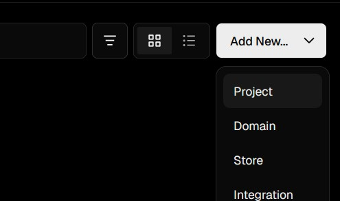

&emsp;&emsp;&emsp;&emsp;Paso 3: Selección el repositorio y desplegar.

**Figura**

*Captura de pantalla de la seccion de despliegue de Vercel*

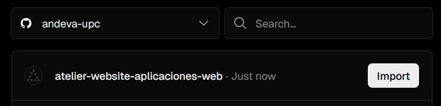

**Figura**

*Captura de pantalla de la configuración de despliegue de Vercel*

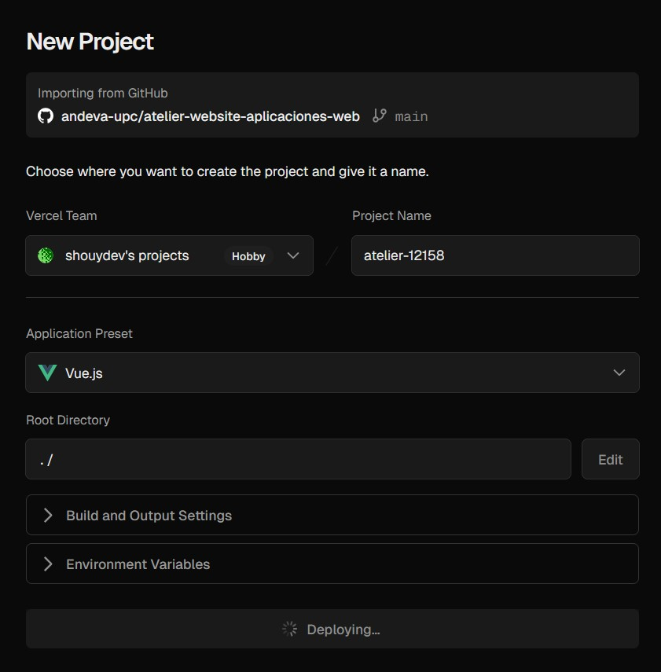

&emsp;&emsp;&emsp;&emsp;Paso 4: Obtención del enlace público y validación: [https://atelier-12158.vercel.app/](https://atelier-12158.vercel.app/).

#### 5.2.1.8.&emsp;&emsp;*Team Collaboration Insights during Sprint* {#cap-5-2-1-8}

&emsp;&emsp;&emsp;&emsp;En esta sección el equipo explica cómo se han desarrollado las actividades de implementación durante el primer sprint y se presentan las evidencias analíticas de colaboración en GitHub.

&emsp;&emsp;&emsp;&emsp;Joel Huamani: Lideró la estructuración semántica de la cabecera principal, configuró los botones de llamado a la acción y enlazó las normativas legales. Además, trabajó en los media queries para la adaptabilidad móvil de estas vistas.

&emsp;&emsp;&emsp;&emsp;Adiel Sanchez: Se encargó de la maquetación de la sección de presentación del equipo, aplicó los estilos visuales principales al Hero y aseguró el comportamiento responsivo del pie de página.

&emsp;&emsp;&emsp;&emsp;Luis Granda: Fue el responsable de estructurar la sección de exploración de módulos, asegurando el correcto espaciado y layout mediante CSS.

&emsp;&emsp;&emsp;&emsp;Aldo Machacca: Lideró la codificación de la tabla comparativa de los planes de suscripción, integró los recursos gráficos optimizados e implementó la vista responsiva de la matriz de precios.

&emsp;&emsp;&emsp;&emsp;Jennifer Riveros: Se enfocó en la maquetación y estilizado del pie de página general, además de colaborar en la carga de la información de los perfiles en la sección del equipo.

&emsp;&emsp;&emsp;&emsp;A continuación, se presentan las capturas en imagen de los analíticos de colaboración y commits extraídos de la pestaña "Insights" del repositorio en GitHub, las cuales evidencian la participación de todos los miembros del equipo:

**Figura**

*Gráfico de commits*

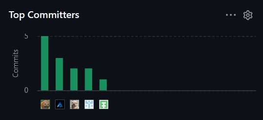

### 5.2.2.&emsp;&emsp;*Sprint 2* {#cap-5-2-2}

#### 5.2.2.1.&emsp;&emsp;*Sprint Planning 2* {#cap-5-2-2-1}

&emsp;&emsp;&emsp;&emsp;En esta sección se detallan los acuerdos y la organización alcanzados durante la sesión de planificación para el segundo sprint del proyecto Atelier. A diferencia de la iteración anterior centrada en la captación, este sprint se enfoca en el desarrollo del front-end de los módulos operativos fundamentales que permitirán la gestión del taller.

&emsp;&emsp;&emsp;&emsp;A continuación, se presenta el cuadro de resumen del sprint planning:

**Tabla**

*Tabla de Sprint 2 de atelier*

| Sprint # | Sprint 2 |
|:--------:|:--------|
|    **Sprint Planning Background**      |    --      |
|    Date      |    2026-05-12      |
|    Time      |    03:00 PM      |
|    Location      |    Reunión virtual mediante el canal de voz de Discord      |
|    Prepared By      |     Huamani Estefanero, Joel     |
|    Attendees     |     Huamani Estefanero, Joel/Granda Ibarra, Luis Daniel/Machacca Soto, Aldo Jeanfranco/Riveros Vera, Jennifer Yamilet/Sanchez Santin, Adiel Abdiaz     |
|    Sprint 2 - 1 Review Summary      |    The team successfully developed and deployed the functional landing page. All planned user stories regarding the value proposition, service modules, and subscription plans were completed and verified on the production environment.      |
|    Sprint 2 – 1 Retrospective Summary      |    The team identified that initial task estimations were too low. For the upcoming sprint, we committed to consolidating engineering tasks into blocks of 4 to 8 hours and ensuring a more rigorous technical documentation process.      |
|     **Sprint Goal & User Stories**     |          |
|     Sprint 2 Goal     |     Our focus for this sprint is to develop the front-end architecture and functional user interfaces for the core modules of the Atelier web application. We aim to implement the Dashboard, Work-Orders, Telemetry, Customers, Appointments, and Billing sections, ensuring a consistent UI/UX, seamless navigation, and data visualization to support essential workshop operations.     |
|     Sprint 2 Velocity     |     35     |
|     Sum of Story Points     |   69       |

#### 5.2.2.2.&emsp;&emsp;*Aspect Leaders and Collaborators* {#cap-5-2-2-2}

&emsp;&emsp;&emsp;&emsp;Se han designado los responsables de liderar el desarrollo del front-end de cada módulo operativo para asegurar la especialización en la lógica de cada vista.

**Tabla**

*Leadership-and-Collaboration Matrix*

<table>
<thead>
<tr>
<th>Team Member</th>
<th>GitHub Username</th>
<th>Home</th>
<th>Work-Orders</th>
<th>Telemetry & Customers</th>
<th>Appointments</th>
<th>Inventory</th>
<th>Billing</th>
</tr>
</thead>
<tbody>
<tr>
<td>Granda Ibarra, Luis Daniel</td>
<td>danieltyuyu</td>
<td></td>
<td></td>
<td></td>
<td></td>
<td></td>
<td>L</td>
</tr>
<tr>
<td>Huamani Estefanero, Joel</td>
<td>shouydev</td>
<td>L</td>
<td></td>
<td></td>
<td></td>
<td></td>
<td></td>
</tr>
<tr>
<td>Machacca Soto, Aldo Jeanfranco</td>
<td>AldoDev20</td>
<td></td>
<td>C</td>
<td>L</td>
<td></td>
<td></td>
<td></td>
</tr>
<tr>
<td>Riveros Vera, Jennifer Yamilet</td>
<td>Jennivz</td>
<td></td>
<td></td>
<td></td>
<td>L</td>
<td></td>
<td></td>
</tr>
<tr>
<td>Sanchez Santin, Adiel Abdiaz</td>
<td>xs4el</td>
<td></td>
<td></td>
<td></td>
<td></td>
<td>L</td>
<td></td>
</tr>
</tbody>
</table>

#### 5.2.2.3.&emsp;&emsp;*Sprint Backlog 2* {#cap-5-2-2-3}

&emsp;&emsp;&emsp;&emsp;Como se estableció en el Sprint Planning, el objetivo principal de este segundo sprint es el desarrollo de la web application de atelier.

&emsp;&emsp;&emsp;&emsp;A continuación, se presenta una captura de pantalla del sprint backlog en la herramienta de gestión Trello, junto con su respectivo enlace público: [https://trello.com/invite/b/69e53a1f24bfdaee349e4ae0/ATTI7bbd33d5db1338ca2c51df8c95727a2a46CEA512/atelier](https://trello.com/invite/b/69e53a1f24bfdaee349e4ae0/ATTI7bbd33d5db1338ca2c51df8c95727a2a46CEA512/atelier).

**Figura**

*Captura de Pantalla del Sprint Backlog #2 atelier en Trello*

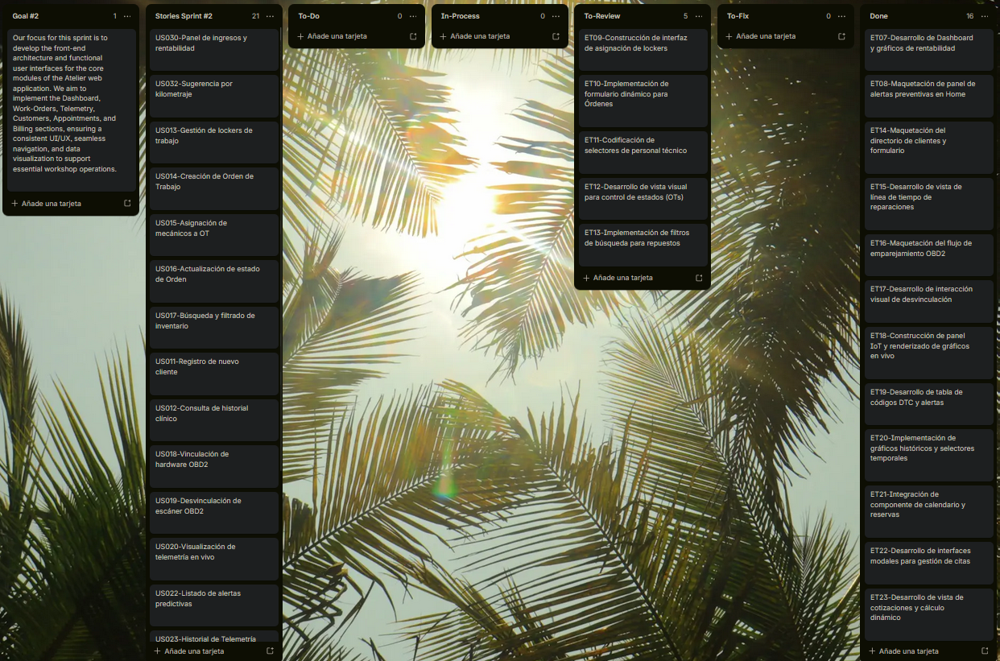

&emsp;&emsp;&emsp;&emsp;Seguidamente, se detalla la tabla de control de estado con la descomposición de las User Stories en tareas específicas asignadas a los miembros del equipo, estimadas en horas y con su estado actual de progreso.

**Tabla**

*Sprint Backlog #2 atelier*

| Sprint #   | Sprint 2                            |                  |                                                                |                                                                                                                                              |                    |                 |                                                |
|------------|-------------------------------------|------------------|----------------------------------------------------------------|----------------------------------------------------------------------------------------------------------------------------------------------|--------------------|-----------------|------------------------------------------------|
| User Story |                                     | Work-Item / Task |                                                                |                                                                                                                                              |                    |                 |                                                |
| Id         | Title                               | Id               | Title                                                          | Description                                                                                                                                  | Estimation (Hours) | Assigned To     | Status (To-do / In-Process / To-Review / Done) |
| US030      | Panel de ingresos y rentabilidad    | ET07             | Desarrollo de Dashboard y gráficos de rentabilidad             | Codificar la interfaz del Home integrando librerías de gráficos y tarjetas de resumen para exponer visualmente las métricas financieras.     | 6                  | Joel Huamani    | Done                                          |
| US032      | Sugerencia por kilometraje          | ET08             | Maquetación de panel de alertas preventivas en Home            | Desarrollar la sección del Dashboard dedicada a listar notificaciones y sugerencias proactivas de vehículos que superaron su kilometraje.    | 4                  | Joel Huamani    | Done                                          |
| US013      | Gestión de lockers de trabajo       | ET09             | Construcción de interfaz de asignación de lockers              | Desarrollar la interfaz gráfica y los indicadores visuales de estado (ocupado/disponible) para la gestión de espacios físicos del taller.    | 4                  | Joel Huamani | Done                                          |
| US014      | Creación de Orden de Trabajo        | ET10             | Implementación de formulario dinámico para Órdenes             | Maquetar el formulario interactivo para registrar órdenes de trabajo, incorporando selectores de clientes/vehículos y campos de descripción. | 6                  | Joel Huamani | Done                                          |
| US015      | Asignación de mecánicos a OT        | ET11             | Codificación de selectores de personal técnico                 | Implementar la lógica visual y los componentes desplegables para asignar y vincular mecánicos a las órdenes de trabajo activas.              | 4                  | Joel Huamani | Done                                          |
| US016      | Actualización de estado de Orden    | ET12             | Desarrollo de vista visual para control de estados (OTs)       | Implementar la interfaz interactiva para visualizar, filtrar y actualizar el progreso técnico y los diagnósticos de las órdenes de trabajo.  | 5                  | Joel Huamani | Done                                          |
| US017      | Búsqueda y filtrado de inventario   | ET13             | Implementación de filtros de búsqueda para repuestos           | Construir la barra de búsqueda y los componentes de filtrado por categoría para localizar repuestos rápidamente durante la reparación.       | 4                  | Joel Huamani | Done                                          |
| US011      | Registro de nuevo cliente           | ET14             | Maquetación del directorio de clientes y formulario            | Codificar el listado maestro de clientes y el formulario de captura de datos con sus respectivas validaciones visuales de campos.            | 5                  | Aldo Machacca   | Done                                          |
| US012      | Consulta de historial clínico       | ET15             | Desarrollo de vista de línea de tiempo de reparaciones         | Maquetar la interfaz que expone el historial clínico de los vehículos, ordenando cronológicamente las órdenes de trabajo previas.            | 5                  | Aldo Machacca   | Done                                          |
| US018      | Vinculación de hardware OBD2        | ET16             | Maquetación del flujo de emparejamiento OBD2                   | Codificar los modales y validaciones visuales para la asociación del identificador del escáner telemático al perfil del vehículo.            | 4                  | Aldo Machacca   | Done                                          |
| US019      | Desvinculación de escáner OBD2      | ET17             | Desarrollo de interacción visual de desvinculación             | Implementar los botones de acción y cuadros de diálogo de confirmación para liberar el hardware OBD2 de un vehículo activo.                  | 4                  | Aldo Machacca   | Done                                         |
| US020      | Visualización de telemetría en vivo | ET18             | Construcción de panel IoT y renderizado de gráficos en vivo    | Construir la interfaz dinámica que renderizará los gráficos y métricas (RPM, Temperatura) simulando la conexión continua del dispositivo.    | 7                  | Aldo Machacca   | Done                                          |
| US022      | Listado de alertas predictivas      | ET19             | Desarrollo de tabla de códigos DTC y alertas                   | Desarrollar la tabla interactiva que lista, filtra y clasifica por criticidad las alertas telemáticas recibidas de los vehículos.            | 5                  | Aldo Machacca   | Done                                          |
| US023      | Historial de Telemetría             | ET20             | Implementación de gráficos históricos y selectores temporales  | Codificar los componentes visuales para consultar rangos de fechas y renderizar gráficas con la data telemática agregada del pasado.         | 5                  | Aldo Machacca   | Done                                         |
| US024      | Agendamiento de citas               | ET21             | Integración de componente de calendario y reservas             | Implementar una vista de calendario interactiva para la visualización gráfica y el registro de nuevas reservas de mantenimiento.             | 6                  | Jennifer        | Done                                          |
| US025      | Reprogramación de citas             | ET22             | Desarrollo de interfaces modales para gestión de citas         | Codificar los modales y la interacción visual para permitir la reprogramación rápida o cancelación de fechas de citas preexistentes.         | 4                  | Jennifer        | Done                                          |
| US026      | Creación de cotización digital      | ET23             | Desarrollo de vista de cotizaciones y cálculo dinámico         | Desarrollar la vista para armar cotizaciones, permitiendo agregar servicios y repuestos con cálculo en tiempo real del subtotal e impuestos. | 6                  | Luis Granda     | Done                                         |
| US028      | Registro de cobro en caja           | ET24             | Implementación de interfaz de pasarela y comprobantes          | Maquetar el formulario de cierre comercial que permite seleccionar el método de pago y emitir la vista previa del comprobante.               | 5                  | Luis Granda     | Done                                          |
| US029      | Aplicación de descuentos            | ET25             | Codificación de lógica visual para deducción de descuentos     | Implementar campos de validación y la lógica reactiva en la interfaz para aplicar porcentajes de descuento sobre el subtotal facturado.      | 4                  | Luis Granda     | Done                                          |
| US008      | Alta de nuevos repuestos            | ET26             | Desarrollo de listado de inventario y formulario de alta       | Codificar la vista del catálogo de repuestos y el formulario interactivo para la creación de nuevos ítems con validación de SKU.             | 6                  | Adiel Sanchez   | Done                                          |
| US009      | Ajuste manual de stock              | ET27             | Implementación de controles visuales para ajuste de inventario | Desarrollar los controles interactivos (+/-) y la lógica de validación visual para prevenir que el stock se ajuste a números negativos.      | 5                  | Adiel Sanchez   | Done                                          |

#### 5.2.2.4.&emsp;&emsp;*Development Evidence for Sprint Review* {#cap-5-2-2-4}

&emsp;&emsp;&emsp;&emsp;En esta sección se explican y presentan los avances en implementación correspondientes al segundo sprint del proyecto Atelier. De acuerdo con el alcance establecido en el Sprint Planning.

&emsp;&emsp;&emsp;&emsp;A continuación, se presenta la tabla detallada que incluye, para el repositorio de la web application, los commits directamente relacionados con la implementación de las características mencionadas:

**Tabla**

*Tabla de Commits del Sprint #2*

| Repository | Branch | Commit Id | Commit Message | Commit Message Body | Commited On |
|:----------:|:------:|-----------|----------------|---------------------|-------------|
|     andeva-upc/atelier-web-app-aplicaciones-web       |    develop    |     6e76e6df      |       chore: initial commit.         |                     |     23/04/2026 11:57        |
|     andeva-upc/atelier-web-app-aplicaciones-web       |    develop    |     32dd8f39      |      feat(material-design): add angular material theming and update styles.          |                     |      23/04/2026 12:02       |
|     andeva-upc/atelier-web-app-aplicaciones-web       |    develop    |     4786effa      |    feat(i18n): add ngx-translate for internationalization support.            |                     |      23/04/2026 at 12:04       |
|     andeva-upc/atelier-web-app-aplicaciones-web       |     develop   |    302e7c70       |      feat(i18n): integrate ngx-translate for multilingual support and add language files.          |                     |      23/04/2026 12:14       |
|     andeva-upc/atelier-web-app-aplicaciones-web       |   develop     |     09075a73      |       feat(header): add header component with logo and buttons.         |                     |      23/04/2026 13:57       |
|     andeva-upc/atelier-web-app-aplicaciones-web       |   develop     |    6e46c61d       |        feat(value-proposition): add hero component with title, subtitle, and buttons.        |                     |      23/04/2026 at 15:19       |
|     andeva-upc/atelier-web-app-aplicaciones-web       |   develop     |     fedbfc39      |       style(header): update media query to hide button container on smaller screens.         |                     |      23/04/2026 15:22       |
|     andeva-upc/atelier-web-app-aplicaciones-web       |    develop    |     b80c7e97      |        style(value-proposition): adjust background position for improved layout        |                     |      23/04/2026 15:27       |
|     andeva-upc/atelier-web-app-aplicaciones-web       |    develop    |      e53f7f1b     |       style(header): hide logo text on smaller screens and update hero z-index.         |                     |      23/04/2026 15:32       |
|     andeva-upc/atelier-web-app-aplicaciones-web       |    develop    |     3aae419f      |        style(value-proposition): update button styles and adjust layout for improved responsiveness.        |                     |       on 23/04/2026 at 15:47      |
|     andeva-upc/atelier-web-app-aplicaciones-web       |   develop     |      070f4fd8     |        feat(benefits): add card component with animation and styling.        |                     |     23/04/2026 19:50        |
|     andeva-upc/atelier-web-app-aplicaciones-web       |     develop   |     9f2e6d86      |        feat(pricing): initialize pricing component structure and integration.        |                     |     25/04/2026 00:17        |
|     andeva-upc/atelier-web-app-aplicaciones-web       |   develop     |     aff3e5e2      |       feat(pricing): implement pricing toggle with signals and responsive styles.         |                     |     25/04/2026 00:21        |
|     andeva-upc/atelier-web-app-aplicaciones-web       |   develop     |     d4d445e7      |       feat(pricing): implement pricing cards with dual-background design and dynamic prices.         |                     |      25/04/2026 00:48       |
|     andeva-upc/atelier-web-app-aplicaciones-web       |   develop     |     774ba6b6      |        feat(pricing): complete pricing section with footer disclaimer, contact button and full responsive design.        |                     |      25/04/2026 01:15       |
|     andeva-upc/atelier-web-app-aplicaciones-web       |   develop     |     5609a2fd      |       feat(team-info): add team component with member profiles.         |                     |       25/04/2026 10:32      |
|     andeva-upc/atelier-website-aplicaciones-web       |   develop     |     d859ca4c      |         fix(team): add mariana's photo and fix card image background.       |                     |        25/04/2026 15:53     |
|     andeva-upc/atelier-web-app-aplicaciones-web       |   develop     |     5ec553fd      |         feat: add footer in the landing page.       |                     |      25/04/2026 19:56       |
|     andeva-upc/atelier-web-app-aplicaciones-web       |   develop     |      1c51d1ac     |        fix(footer): reorganize footer component imports and file structure.        |                     |      26/04/2026 07:07       |
|     andeva-upc/atelier-web-app-aplicaciones-web       |   main     |     a4d98cd5      |        Release/2.0.0        |                     |      26/04/2026 07:23       |

#### 5.2.2.5.&emsp;&emsp;*Execution Evidence for Sprint Review* {#cap-5-2-2-5}

&emsp;&emsp;&emsp;&emsp;Durante este sprint se logro implementar y desplegar una primera versión del front end de la aplicación web de atelier.

&emsp;&emsp;&emsp;&emsp;A continuación, se presentan las capturas de pantalla de las principales vistas implementadas, junto con un enlace a un video demostrativo que ilustra y explica a detalle la visualización y navegación logrados en este Sprint: .

**Figura**

*Capturas de Pantalla de la Web App de atelier*

#### 5.2.2.6.&emsp;&emsp;*Services Documentation Evidence for Sprint Review* {#cap-5-2-2-6}

&emsp;&emsp;&emsp;&emsp;Para la ejecución y validación del desarrollo del Front-end durante el Sprint 2, el equipo adoptó un enfoque de desarrollo paralelo. Dado que el Backend definitivo será desarrollado en iteraciones posteriores, se implementó y desplegó una Mock API utilizando JSON-Server, alojada en el servicio en la nube Render.

&emsp;&emsp;&emsp;&emsp;Este enfoque permitió a los líderes de cada aspecto realizar peticiones HTTP reales desde la aplicación web en Angular, simulando el comportamiento transaccional del sistema y validando el renderizado dinámico de los componentes en producción.

#### 5.2.2.7.&emsp;&emsp;*Software Deployment Evidence for Sprint Review* {#cap-5-2-2-7}

&emsp;&emsp;&emsp;&emsp;En esta sección se resumen los procesos realizados en relación con el despliegue durante el segundo sprint del proyecto Atelier. A diferencia de la iteración anterior, donde el esfuerzo técnico se centró exclusivamente en alojar la Landing Page, durante este Sprint 2 el equipo amplió significativamente la infraestructura en la nube para abarcar los nuevos productos de software construidos: la Web Application y los Web Services.

&emsp;&emsp;&emsp;&emsp;Paso 1: Verificamos que el repositorio de Github este preparado para el despliegue.

**Figura**

*Repositorio del web app de atelier*

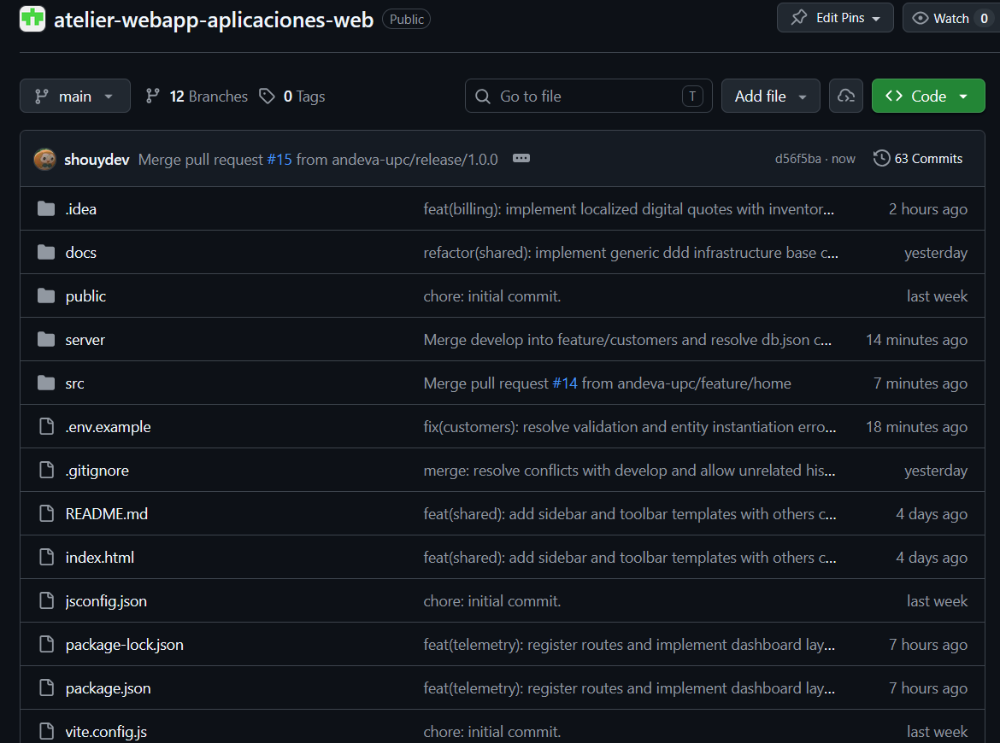

&emsp;&emsp;&emsp;&emsp;Paso 2: Configuración del entorno en Vercel.

**Figura**

*Captura de pantalla de la seccion de proyectos de Vercel*

&emsp;&emsp;&emsp;&emsp;Paso 3: Selección el repositorio y desplegar.

**Figura**

*Captura de pantalla de la seccion de despliegue de Vercel*

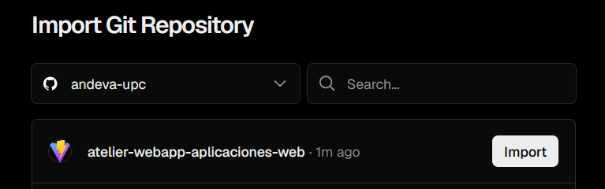

**Figura**

*Captura de pantalla de la configuración de despliegue de Vercel*

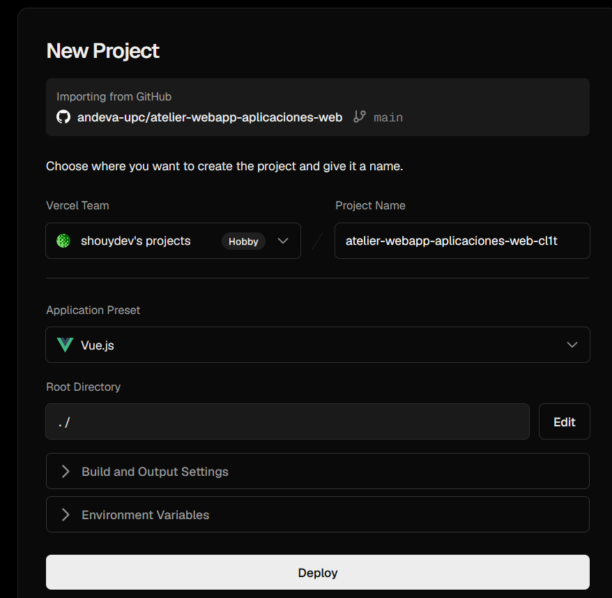

&emsp;&emsp;&emsp;&emsp;Paso 4: Obtención del enlace público y validación: .

#### 5.2.2.8.&emsp;&emsp;*Team Collaboration Insights during Sprint* {#cap-5-2-2-8}

&emsp;&emsp;&emsp;&emsp;En esta sección el equipo explica cómo se han desarrollado las actividades de implementación durante el segundo sprint y se presentan las evidencias analíticas de colaboración en GitHub.

&emsp;&emsp;&emsp;&emsp;Joel Huamani: En la Web Application, maquetó la sidebar, toolbar y Dashboard con lo cual integró las tarjetas de analítica financiera consumiendo los endpoints correspondientes.

&emsp;&emsp;&emsp;&emsp;Adiel Sanchez: Implementó las vistas de Inventory e interactuó con los Web Services consumiendo el endpoint /products para el control de stock.

&emsp;&emsp;&emsp;&emsp;Luis Granda: Se encargó de codificar las interfaces del módulo de Billing. Para validar su funcionamiento, estructuró la comunicación con los Web Services mediante los endpoints /quotes y /payments, simulando el cierre financiero de las reparaciones.

&emsp;&emsp;&emsp;&emsp;Aldo MAchacca: Lideró el desarrollo del producto Web Services configurando la arquitectura base del archivo db.json para la Mock API y desplegándolo en Render. Lideró la implementación de las vistas de Telemetry y Customers en el Front-end. Además, colaboró activamente en la definición del esquema de datos de los Web Services, mapeando las respuestas simuladas de los endpoints /telemetry_snapshots y /vehicle_dtc_alerts para renderizar las gráficas dinámicas de los vehículos.

&emsp;&emsp;&emsp;&emsp;Jennifer Riveros: Centró su esfuerzo en la Web Application desarrollando las interfaces del módulo de Quotes. Interactuó con los endpoints de /quotes como principal. 

&emsp;&emsp;&emsp;&emsp;A continuación, se presentan las capturas en imagen de los analíticos de colaboración y commits extraídos de la pestaña "Insights" del repositorio en GitHub, las cuales evidencian la participación de todos los miembros del equipo:

**Figura**

*Gráfico de commits*

