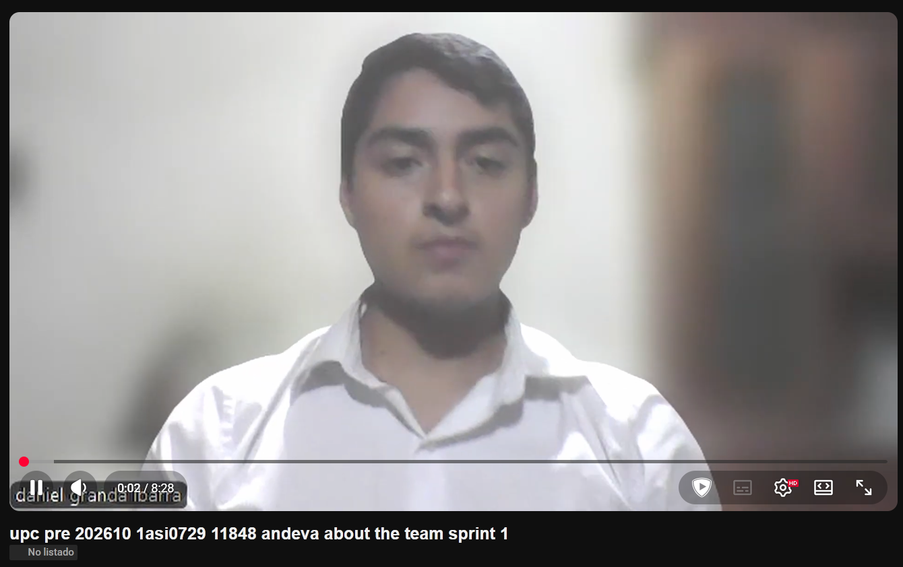

# Conclusiones {#conclusiones}

##### Descripción:

&emsp;&emsp;&emsp;&emsp;El desarrollo de la aplicación web Atelier ha resuelto de manera efectiva los Problem Statements definidos en la fase inicial del proyecto. Se evidenció que la gestión empírica en los talleres mecánicos y la desconexión total entre el diagnóstico vehicular y la administración financiera generaban graves cuellos de botella operativos. La solución web implementada, basada en una arquitectura escalable orientada a servicios y un cliente web interactivo, centralizó exitosamente el control de inventario, las órdenes de trabajo y la lectura de telemetría IoT, brindando a los administradores una herramienta de gestión unificada y altamente disponible.

&emsp;&emsp;&emsp;&emsp;Al plantear nuestros assumptions, se asumió que el personal operativo mostraría una fuerte resistencia al uso de una aplicación web durante sus horas laborales, considerándolo una fricción adicional a su trabajo físico. No obstante, las sesiones de validación revelaron un comportamiento real muy distinto: al interactuar con interfaces responsivas, limpias y adaptadas a pantallas móviles, el segmento técnico adoptó rápidamente el sistema. Demostraron un alto nivel de receptividad al poder visualizar códigos de falla y gráficos de telemetría en tiempo real directamente desde la web, eliminando la dependencia de escáneres manuales obsoletos y agilizando su labor.

&emsp;&emsp;&emsp;&emsp;Nuestras Hypotheses Statements sostenían que la implementación de un panel de salud vehicular predictivo integrado a un módulo de facturación comercial reduciría los tiempos de diagnóstico y aumentaría la transparencia frente al cliente final. Los resultados obtenidos en las validaciones confirmaron estas premisas, superando los criterios de éxito establecidos en el Lean UX Canvas: los dueños de taller de prueba lograron completar flujos críticos sin asistencia, reportando niveles de usabilidad sobresalientes. Esto valida que la plataforma web aporta un valor de negocio tangible y verificable.

##### Recomendaciones:

- Evolución a Progressive Web App (PWA): Se recomienda transformar la aplicación web actual en una PWA. Dado que la infraestructura de red en las bahías de reparación de los talleres suele ser inestable, contar con capacidades offline y almacenamiento en caché local garantizará que los mecánicos puedan seguir actualizando el estado de las órdenes de trabajo sin interrupciones.

- Implementación de WebSockets para Telemetría de Alta Frecuencia: Para optimizar el panel de diagnóstico en vivo, el siguiente paso arquitectónico es transicionar de peticiones HTTP tradicionales (polling) a conexiones persistentes y bidireccionales mediante WebSockets (como SignalR). Esto reducirá la latencia a milisegundos en la recepción de datos críticos del motor (RPM, temperatura, presión).

- Módulo de Facturación Electrónica Nativa: Como evolución del componente comercial, se debe planificar la integración directa del Web Service de Atelier con los sistemas de la entidad tributaria nacional mediante APIs gubernamentales. Esto automatizará la emisión y declaración de boletas y facturas, consolidando a Atelier como un ERP integral y autónomo.

# Video About-the-Team {#video-about-the-team}

Link Drive: [Video About-the-Team](https://upcedupe-my.sharepoint.com/:v:/g/personal/u20241e275_upc_edu_pe/IQDvMNjPhoPmS43tKbKfQNxjARmssepA1z1TUKyHMfzkxA8?nav=eyJyZWZlcnJhbEluZm8iOnsicmVmZXJyYWxBcHAiOiJPbmVEcml2ZUZvckJ1c2luZXNzIiwicmVmZXJyYWxBcHBQbGF0Zm9ybSI6IldlYiIsInJlZmVycmFsTW9kZSI6InZpZXciLCJyZWZlcnJhbFZpZXciOiJNeUZpbGVzTGlua0NvcHkifX0&e=WcgUZb)

Link Youtube: [Video About-the-Team](https://youtu.be/e-bgYJt9DrQ)

**Figura 124**

*Captura de pantalla del Video About-The-Team*

